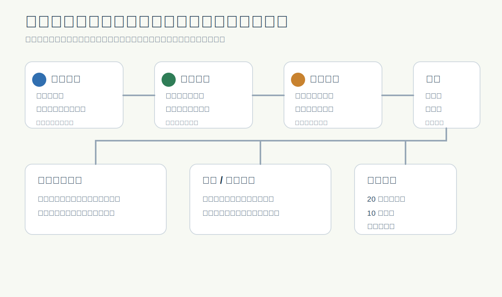

# WheelWise

<p align="center">
  
</p>

<p align="center">
  <strong>AI Idea Pre-review Board for Codex</strong><br>
  Turn a rough product idea into a Chinese pre-review report, evidence board, visual explanation page, prototype, and Codex-ready execution plan.
</p>

<p align="center">
  <a href="README_ZH.md">中文文档</a>
  ·
  <a href="WORKFLOW_GUIDE_ZH.md">Workflow Guide</a>
  ·
  <a href="IMPLEMENTATION_METHOD.md">Implementation Method</a>
  ·
  <a href="#release-notes">Release Notes</a>
</p>

<p align="center">
  
  
  
  
  
</p>

## What It Is

WheelWise is a Superpowers-style multi-skill pack for Codex and an **AI Idea Pre-review Board**. It is built for early product ideas, before serious engineering, team review, or MVP investment starts.

Use it when an idea is still blurry and you need a structured answer to questions like:

- Should this idea continue, pivot, pause, or stop?
- Is the right next step a prototype, validation experiment, or bounded MVP?
- Which modules should be self-built, purchased, reused, forked, or used only as references?
- What evidence is missing before a credible product decision?
- What should Codex build next if the idea passes pre-review?

WheelWise is not a formal approval system. It does not replace real user research, business data, compliance review, legal advice, investment judgment, or organization decisions. It creates a decision-ready pre-review package so those conversations become clearer.

## Quick Start

Always call the controller skill:

```text
Use $using-wheelwise to evaluate this idea:
I want to build an AI resume optimizer for job seekers.
```

For focused decisions, still use the same entry point:

```text
Use $using-wheelwise to decide whether this should be a browser extension or a webpage application.
```

```text
Use $using-wheelwise to evaluate which modules should be self-built, purchased, reused, forked, or used as reference.
```

Expected final chat response is short and artifact-oriented:

```text
Report folder: wheelwise-report-community-tool-share/
Source report: wheelwise-report-community-tool-share/report.md
Web display: wheelwise-report-community-tool-share/index.html
Interactive prototype: wheelwise-report-community-tool-share/prototype.html
```

## Workflow Routes

WheelWise V4.6 does not run the full workflow by default. If the requested depth is unclear, `using-wheelwise` asks the user to choose one of three routes.

| Route | Use when | Default artifact |
| --- | --- | --- |
| 快速判断 | Decide whether the idea is worth continuing | `wheelwise-report-<idea-slug>/report.md` |
| 专项评估 | Focus on one decision such as MVP, reuse, validation, technical route, commercialization, risk, or execution plan | `wheelwise-report-<idea-slug>/report.md` |
| 完整预评审 | Create a formal report, web display, interactive prototype, or stakeholder-ready package | Complete report folder |

Full pre-review core flow:

```text
Idea Intake
  -> Gate0 Evidence Intake
  -> Surface Strategy
  -> Gate1 Early Feasibility
  -> Market / Customer / Reuse Discovery
  -> Evidence Board
  -> Product / Commercial / Risk Synthesis
  -> Gate2 Full Review
  -> Technical Plan
  -> Visual Brief
  -> Interactive Prototype
  -> Report Visualization
  -> Execution Plan
```

## Output Package

Every route creates at least:

```text
wheelwise-report-<idea-slug>/
  report.md
```

Full pre-review creates:

```text
wheelwise-report-<idea-slug>/
  project-state.md
  evidence-board.md
  report.md
  index.html
  prototype.html
  assets/
```

`report.md` is the source of truth. `index.html` is the consulting-style visual explanation layer. `prototype.html` is an independent product-surface simulation, playground, calculator, terminal preview, validation dashboard, or workflow simulator depending on the idea.

## Product States

WheelWise maps Gate decisions to one Chinese pre-review state:

| State | Meaning |
| --- | --- |
| 可进入原型验证 | Enough evidence exists for low-cost prototype or simulator validation |
| 可进入最小可行产品实验 | Evidence, scope, risk, and execution path are coherent enough for a bounded MVP experiment |
| 需要补充关键证据 | A high-impact evidence gap blocks a credible decision |
| 建议转向后再评审 | Evidence supports a materially different direction |
| 建议暂缓 | Timing, dependency, regulation, budget, team fit, or market condition blocks near-term progress |
| 建议放弃 | The idea is unsafe, implausible, undifferentiated, or lacks a credible user or buyer |
| 仅作为参考 | Useful as learning or module reference, but not worth direct build now |

Every important conclusion is labeled as `fact`, `assumption`, `inference`, or `evidence gap`.

## Skill Map

| Skill | Role |
| --- | --- |
| `using-wheelwise` | Main controller, router, Gate owner, evidence arbiter, final package synthesizer |
| `idea-intake` | Converts a raw idea into a structured brief |
| `surface-strategy` | Chooses website, web app, mobile app, desktop app, extension, API/service, CLI, or automation surface |
| `feasibility-review` | Screens feasibility and maps Gate verdicts to pre-review states |
| `market-research` | Reviews market category, competitors, substitutes, demand signals, trends, maturity, and barriers |
| `customer-discovery` | Defines personas, jobs-to-be-done, pain intensity, adoption objections, and validation experiments |
| `evidence-board` | Consolidates evidence into an internal decision ledger |
| `product-strategy` | Defines positioning, differentiation, product wedge, and MVP scope |
| `reuse-evaluator` | Evaluates self-build, purchase, reuse, fork, and reference decisions by module |
| `technical-planning` | Converts decisions into stack, architecture, data, integration, and deployment guidance |
| `commercialization` | Plans business model, pricing, packaging, channels, sales motion, and early monetization tests |
| `risk-review` | Reviews market, product, technical, legal, privacy, license, dependency, and execution risks |
| `visual-brief` | Plans or creates explanatory visuals under `assets/` |
| `ui-demo` | Plans an independent clickable prototype, simulator, playground, terminal preview, or workflow preview |
| `report-visualization` | Turns `report.md` into visualized `index.html` |
| `execution-plan` | Produces build, prototype, validation, pivot, pause, stop, or reference-preservation tasks |
| `parallel-research` | Optional independent research or review support for complex cases |

## Repository Structure

```text
.codex-plugin/
  plugin.json
skills/
  using-wheelwise/
  idea-intake/
  surface-strategy/
  feasibility-review/
  market-research/
  customer-discovery/
  evidence-board/
  product-strategy/
  reuse-evaluator/
  technical-planning/
  commercialization/
  risk-review/
  visual-brief/
  ui-demo/
  report-visualization/
  execution-plan/
  parallel-research/
shared/
  references/
  templates/
examples/
  ai-resume-optimizer/
  ai-payment-chaser/
  community-tool-share/
scripts/
  check_report_contract.py
```

## Examples

The repository includes complete example packages:

| Example | Shows |
| --- | --- |
| `examples/ai-resume-optimizer/` | Report folder output, concept image, visual display, and prototype |
| `examples/ai-payment-chaser/` | Payment workflow evaluation, evidence board, prototype, and report display |
| `examples/community-tool-share/` | V4-style state, evidence board, decision map, visual report, and prototype |

## Validation

Validate an example report folder:

```powershell
python scripts\check_report_contract.py examples\community-tool-share --folder --skip-filename --v4
```

Validate report templates:

```powershell
python scripts\check_report_contract.py shared\templates\new-product-brief.md --skip-filename
python scripts\check_report_contract.py shared\templates\final-wheelwise-report.md --skip-filename
```

Validate the plugin manifest:

```powershell
python -m json.tool .codex-plugin\plugin.json
python C:\Users\zhenyang.du\.codex\skills\.system\plugin-creator\scripts\validate_plugin.py D:\WheelWise
```

Run whitespace checks before committing:

```powershell
git diff --check
```

## README Inspiration

This README follows patterns common in high-star GitHub projects and README galleries:

- Prominent one-screen summary, badges, and quick start.
- Real project visuals near the top instead of text-only description.
- A clear feature map and artifact tree before deep implementation details.
- Star and release badges for quick repository scanning.
- A Star History section for GitHub growth visibility.

References used for this structure: `sindresorhus/awesome` emphasizes a concise top description and badges, `matiassingers/awesome-readme` curates visual/badge-heavy README examples, and Star History documents embeddable star charts for GitHub READMEs.

## Release Notes

| Date | Version / Commit | Update | What changed functionally |
| --- | --- | --- | --- |
| 2026-06-04 | `v4.6.0` / `3832eaa` | Progressive WheelWise routing | Keeps `using-wheelwise` as the single entry point, adds fixed route confirmation for 快速判断 / 专项评估 / 完整预评审, requires every route to create `report.md`, and loads full contracts only when needed. |
| 2026-06-03 | `e021011` | Pre-review reporting upgrade | Reworks examples, templates, state files, evidence boards, report contract checks, and final output rules so generated reports behave more like full product pre-review packages. |
| 2026-06-02 | `e2a4122` | Implementation docs sync | Updates English and Chinese implementation-method docs to match the V4.4 workflow and output discipline. |
| 2026-06-02 | `c221164` | WheelWise V4.4 | Strengthens idea applicability checks, Gate behavior, customer and market routing, project-state requirements, and V4 report validation. |
| 2026-06-02 | `bd04ef4` | WheelWise V4.3 | Adds the idea applicability standard, stronger decision rationale rules, web research expectations, and broader template/state validation. |
| 2026-06-02 | `8a2608d` | Evidence calibration | Adds evidence classification, decision rationale, web research discipline, stronger assumptions, and cross-skill evidence handoff rules. |
| 2026-06-02 | `d015adf` | V4.1 visual delivery architecture | Adds the `report-visualization` skill, richer visual assets, improved prototype/report display contracts, and visual delivery validation. |
| 2026-06-02 | `83b6e04` | WheelWise V4 workflow | Introduces `project-state.md`, `evidence-board.md`, Gate-driven workflow, Chinese pre-review states, full workflow guide, and canonical V4 examples. |
| 2026-06-01 | `107b0cf` | V3 report prototypes | Adds report folder examples, `index.html`, `prototype.html`, visual assets, and a stronger display contract for generated reports. |
| 2026-06-01 | `acdebdf` | Research and commercialization skills | Adds `market-research`, `customer-discovery`, `commercialization`, and current web research standards. |
| 2026-06-01 | `8ac3bc7` | Expanded README documentation | Adds the Chinese README and expands project usage, workflow, validation, and structure documentation. |
| 2026-06-01 | `93b21f3` | V2.7 report folder output | Moves example output into a report-folder format with `report.md`, `index.html`, `assets/`, and enhanced report contract validation. |
| 2026-06-01 | `f9c8465` | Example display assets | Adds a generated concept image and HTML report display for the AI resume optimizer example. |
| 2026-06-01 | `6aaeb79` | V2.6 report display contract | Adds `check_report_contract.py`, strengthens report templates, and formalizes display/prototype output expectations. |
| 2026-06-01 | `7d410a4` | V2.5 Chinese report output | Requires Chinese report output vocabulary, decision records, and more complete final report templates. |
| 2026-06-01 | `08f5e51` | V2 skill pack | Adds product strategy, technical planning, UI demo, visual brief, and stronger output contracts. |
| 2026-06-01 | `23bf618` | V1 skill pack | Creates the first WheelWise plugin, base skills, shared references, templates, implementation docs, and AI resume optimizer example. |

## Star History

<a href="https://www.star-history.com/#Duzhenyang111/WheelWise&Date">
  <picture>
    <source media="(prefers-color-scheme: dark)" srcset="https://api.star-history.com/svg?repos=Duzhenyang111/WheelWise&type=Date&theme=dark">
    <source media="(prefers-color-scheme: light)" srcset="https://api.star-history.com/svg?repos=Duzhenyang111/WheelWise&type=Date">
    
  </picture>
</a>

## Current Version

Latest repository tag and plugin manifest version: `v4.6.0`.
