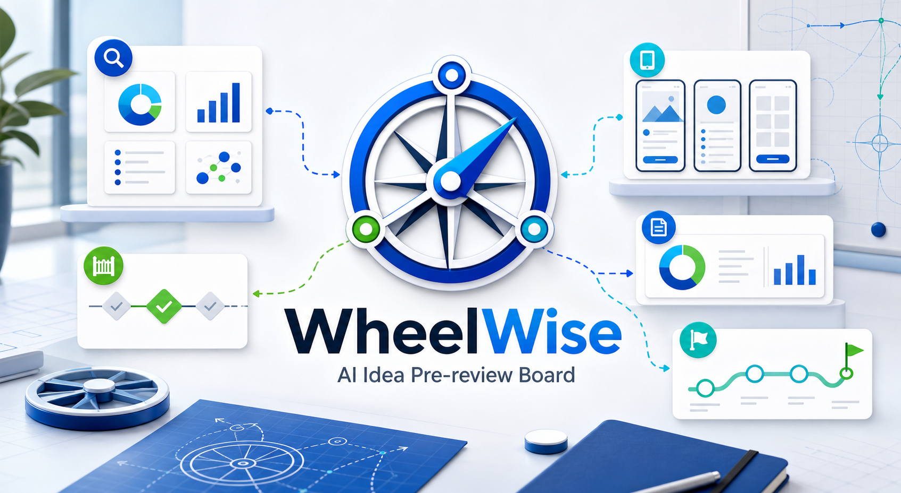

# WheelWise

<p align="center">
  
</p>

<p align="center">
  <strong>面向 Codex 的 AI Idea Pre-review Board / AI 产品预评审系统</strong><br>
  把一个粗糙产品想法整理成中文预评审报告、证据台账、可视化展示页、交互原型和可交给 Codex 执行的计划。
</p>

<p align="center">
  <a href="README.md">English</a>
  ·
  <a href="WORKFLOW_GUIDE_ZH.md">工作流指南</a>
  ·
  <a href="IMPLEMENTATION_METHOD_ZH.md">实现方法</a>
  ·
  <a href="#更新目录">更新目录</a>
</p>

<p align="center">
  
  
  
  
  
</p>

## 它是什么

WheelWise 是一个面向 Codex 的 Superpowers 风格多 skill 包，也是一个 **AI Idea Pre-review Board / AI 产品预评审系统**。它服务于正式开发、团队评审、MVP 投入之前的产品想法阶段。

当一个 idea 还不够清楚时，可以用 WheelWise 回答这些问题：

- 这个想法应该继续、转向、暂缓，还是放弃？
- 下一步更适合做原型验证、补充调研，还是做有限的最小可行产品实验？
- 哪些模块应该自研、购买、复用、分叉改造，哪些只适合作为参考？
- 哪些关键证据还没补齐，导致现在不能做可信决策？
- 如果预评审通过，下一步应该让 Codex 执行什么？

WheelWise 不是正式审批系统，也不替代真实用户调研、真实业务数据、合规审批、法律意见、投资判断或组织决策。它的价值在于把模糊想法变成可讨论、可验证、可比较、可决策的预评审包。

## 快速使用

始终调用主入口：

```text
Use $using-wheelwise to evaluate this idea:
I want to build an AI resume optimizer for job seekers.
```

即使是更窄的问题，也建议通过同一个入口路由：

```text
Use $using-wheelwise to decide whether this should be a browser extension or a webpage application.
```

```text
Use $using-wheelwise to evaluate which modules should be self-built, purchased, reused, forked, or used as reference.
```

最终聊天回复应该短，只给产物路径：

```text
报告文件夹：wheelwise-report-community-tool-share/
源报告：wheelwise-report-community-tool-share/report.md
网页展示：wheelwise-report-community-tool-share/index.html
交互原型：wheelwise-report-community-tool-share/prototype.html
```

## 工作流路线

WheelWise V4.6 不会默认每次运行完整流程。当用户请求深度不清楚时，`using-wheelwise` 会先确认三种路线之一。

| 路线 | 适合场景 | 默认产物 |
| --- | --- | --- |
| 快速判断 | 判断 idea 是否值得继续 | `wheelwise-report-<idea-slug>/report.md` |
| 专项评估 | 只看 MVP、复用、验证、技术、商业化、风险或执行计划中的一个问题 | `wheelwise-report-<idea-slug>/report.md` |
| 完整预评审 | 需要正式报告、网页展示、交互原型或面向评审的完整包 | 完整报告文件夹 |

完整预评审流程：

```text
想法结构化
  -> Gate0 证据输入
  -> 交付形态判断
  -> Gate1 早期可行性
  -> 市场 / 用户 / 复用发现
  -> 证据台账
  -> 产品 / 商业化 / 风险综合
  -> Gate2 完整评审
  -> 技术计划
  -> 视觉说明
  -> 交互原型
  -> 报告可视化
  -> 执行计划
```

## 输出产物

每条路线至少生成：

```text
wheelwise-report-<idea-slug>/
  report.md
```

完整预评审生成：

```text
wheelwise-report-<idea-slug>/
  project-state.md
  evidence-board.md
  report.md
  index.html
  prototype.html
  assets/
```

`report.md` 是事实来源。`index.html` 是咨询式可视化解释层。`prototype.html` 是独立产品界面模拟、接口试验台、成本测算器、终端预览、验证看板或工作流模拟器，具体形态取决于 idea。

## 预评审状态

WheelWise 会把 Gate 决策映射成一个中文预评审状态：

| 状态 | 含义 |
| --- | --- |
| 可进入原型验证 | 证据足够支撑低成本原型或模拟器验证 |
| 可进入最小可行产品实验 | 核心证据、范围、风险和执行路径足够支撑有限实验 |
| 需要补充关键证据 | 高影响证据缺口阻塞可信决策 |
| 建议转向后再评审 | 证据支持不同用户、问题、形态、切入点、商业模式、合规边界或技术路径 |
| 建议暂缓 | 时机、依赖、监管、预算、团队或市场条件暂不适合 |
| 建议放弃 | 不安全、不可行、无差异或缺少可信用户/买方 |
| 仅作为参考 | 可作为学习、模块或横向比较素材，但不建议直接推进 |

所有重要结论都必须标注为 `事实`、`假设`、`推断` 或 `证据缺口`。

## Skill 地图

| Skill | 作用 |
| --- | --- |
| `using-wheelwise` | 主入口、路由、Gate 控制、证据仲裁、最终预评审包汇总 |
| `idea-intake` | 把原始想法转成结构化产品简报 |
| `surface-strategy` | 判断网站、网页应用、移动应用、桌面应用、浏览器插件、接口/服务、命令行工具或自动化工具等交付形态 |
| `feasibility-review` | 做可行性筛查，并把 Gate 结论映射成预评审状态 |
| `market-research` | 调研市场类别、竞品、替代方案、需求信号、趋势、成熟度和进入壁垒 |
| `customer-discovery` | 定义用户画像、待办任务、痛点强度、采用阻力和验证实验 |
| `evidence-board` | 把多来源证据汇总成内部决策台账 |
| `product-strategy` | 定义定位、差异化、产品切入点和最小可行产品范围 |
| `reuse-evaluator` | 按模块评估自研、购买、复用、分叉改造和参考 |
| `technical-planning` | 把决策转成技术栈、架构、数据、集成和部署建议 |
| `commercialization` | 规划商业模式、定价、包装、渠道、销售路径和早期变现测试 |
| `risk-review` | 审查市场、产品、技术、法律、隐私、许可、依赖和执行风险 |
| `visual-brief` | 规划或创建 `assets/` 下的视觉说明资产 |
| `ui-demo` | 规划独立可点击原型、模拟器、接口试验台、终端预览或工作流预览 |
| `report-visualization` | 把 `report.md` 转成可视化网页 `index.html` |
| `execution-plan` | 按预评审状态生成开发、原型、补证、转向、暂缓、放弃或参考保留任务 |
| `parallel-research` | 为复杂调研或独立复核提供可选支持 |

## 仓库结构

```text
.codex-plugin/
  plugin.json
skills/
  using-wheelwise/
  idea-intake/
  surface-strategy/
  feasibility-review/
  market-research/
  customer-discovery/
  evidence-board/
  product-strategy/
  reuse-evaluator/
  technical-planning/
  commercialization/
  risk-review/
  visual-brief/
  ui-demo/
  report-visualization/
  execution-plan/
  parallel-research/
shared/
  references/
  templates/
examples/
  ai-resume-optimizer/
  ai-payment-chaser/
  community-tool-share/
scripts/
  check_report_contract.py
```

## 示例

仓库内置了完整示例包：

| 示例 | 展示重点 |
| --- | --- |
| `examples/ai-resume-optimizer/` | 报告文件夹、概念图、网页展示和交互原型 |
| `examples/ai-payment-chaser/` | 回款流程类 idea 的评估、证据台账、原型和报告展示 |
| `examples/community-tool-share/` | V4 状态、证据台账、决策地图、可视化报告和原型 |

## 校验

校验示例报告文件夹：

```powershell
python scripts\check_report_contract.py examples\community-tool-share --folder --skip-filename --v4
```

校验报告模板：

```powershell
python scripts\check_report_contract.py shared\templates\new-product-brief.md --skip-filename
python scripts\check_report_contract.py shared\templates\final-wheelwise-report.md --skip-filename
```

校验插件清单：

```powershell
python -m json.tool .codex-plugin\plugin.json
python C:\Users\zhenyang.du\.codex\skills\.system\plugin-creator\scripts\validate_plugin.py D:\WheelWise
```

提交前检查空白问题：

```powershell
git diff --check
```

## README 参考方向

这版 README 参考了高 star GitHub 项目常见写法：

- 顶部先给一句话定位、徽章和快速入口。
- 先放真实项目视觉图，而不是纯文字说明。
- 在深层实现细节前，先展示功能地图、产物树和示例。
- 用 Star、Fork、Release、License 徽章帮助读者快速判断仓库状态。
- 加入 Star History，让 GitHub 增长信息可以被直观看到。

结构参考来源包括：`sindresorhus/awesome` 的简洁顶部描述和徽章风格、`matiassingers/awesome-readme` 中收集的视觉化 README 示例，以及 Star History 对 GitHub README 星标图的嵌入说明。

## 更新目录

| 版本 | 时间 | 功能含义 |
| --- | --- | --- |
| `v4.6.0` | 2026-06-04 | 新增渐进式路由：快速判断、专项评估或完整预评审。每条路线都生成 `report.md`，完整产物契约只在需要完整包时加载。 |
| `v4.x` | 2026-06-02 至 2026-06-03 | 把 WheelWise 升级成 Gate 驱动的 AI 产品预评审系统，引入 `project-state.md`、`evidence-board.md`、中文预评审状态、证据分类、评审委员会汇总、更强报告和视觉交付。 |
| `v3.0.0` | 2026-06-01 | 增加报告文件夹示例、`index.html`、`prototype.html`、视觉资产和更强的生成报告展示契约。 |
| `v2.x` | 2026-06-01 | 扩展产品策略、技术规划、UI demo、视觉简报、中文报告词汇、报告文件夹输出和契约校验。 |
| `v1.0.0` | 2026-06-01 | 创建第一版 WheelWise 插件、基础 skills、共享参考、模板、实现文档和 AI 简历优化器示例。 |

## Star History

<a href="https://www.star-history.com/#Duzhenyang111/WheelWise&Date">
  <picture>
    <source media="(prefers-color-scheme: dark)" srcset="https://api.star-history.com/svg?repos=Duzhenyang111/WheelWise&type=Date&theme=dark">
    <source media="(prefers-color-scheme: light)" srcset="https://api.star-history.com/svg?repos=Duzhenyang111/WheelWise&type=Date">
    
  </picture>
</a>

## 当前版本

最新 Git tag 与插件清单版本：`v4.6.0`。
