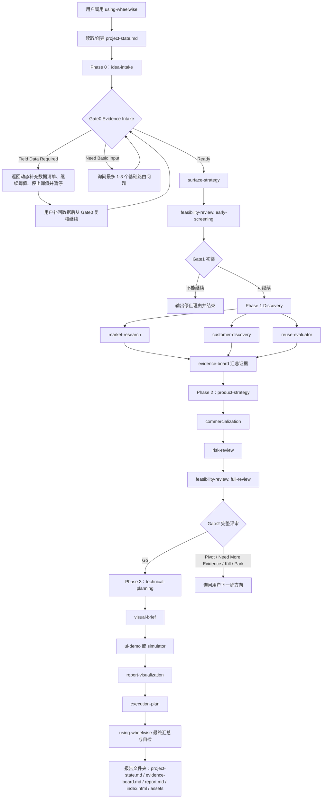

# WheelWise 全流程运行说明

本文档说明 WheelWise V4 的完整运行流程、各个 skill 的输入输出、协作关系、状态管理、Gate 控制、实现方式，以及后续可以优化或新增的能力。它面向维护者、二次开发者和希望理解 WheelWise 内部机制的使用者。

## 1. 总体目标

WheelWise 的目标不是直接替用户写一个产品，而是在正式开发前完成一轮有数据支撑的产品前期调研、产品与工程决策：

- 把模糊想法结构化。
- 判断 idea 适用性分类，并通过 Gate0 Evidence Intake 在数据不足时返回按类型生成的补充数据清单。
- 判断最适合的交付形态。
- 判断是否值得构建最小可行产品、先验证、暂停或放弃。
- 补充市场、用户、商业化、合规和上线前置证据。
- 明确产品策略、差异化和验证路径。
- 判断模块应该自研、购买、复用、分叉改造或仅参考。
- 形成技术实现路径。
- 规划视觉说明、网页展示和交互原型。
- 输出可交给 Codex 执行的计划。
- 生成完整中文报告文件夹。
- 保证所有结论都有数据、证据或明确证据缺口支撑。
- 使用 `project-state.md` 记录跨 skill 状态。
- 使用 `evidence-board.md` 汇总跨 skill 证据。

最终产物不是聊天摘要，而是一个文件夹：

```text
wheelwise-report-<idea-slug>/
  project-state.md
  evidence-board.md
  report.md
  index.html
  prototype.html
  assets/
```

其中 `project-state.md` 是内部流程状态，`evidence-board.md` 是内部证据中枢，`report.md` 是源报告，`index.html` 是报告可视化解释层，`prototype.html` 是独立产品交互原型，`assets/` 存放图片、SVG、HTML/CSS 图表或 Mermaid 兜底资产。

## 2. 总流程图



`using-wheelwise` 是唯一主入口。用户不需要手动调用所有内部 skill；主入口根据请求复杂度决定是否执行完整流程、短流程或调研密集流程，并负责更新 `project-state.md`、`evidence-board.md` 与 Gate 状态。V4.4 中，主入口还负责 Gate0 Evidence Intake、按 idea 类型生成补充数据清单、记录可恢复暂停状态、合规与上线前置项，以及“所有结论必须有数据支撑”的最终自检。

## 3. 运行模式

WheelWise 不是每次都机械执行全部 skill。它根据用户请求选择运行模式。

### 3.1 短流程

适合用户只问一个窄问题，例如：

- 这个产品更适合网页应用还是浏览器插件？
- 认证模块应该自研还是购买？
- 这个想法现在值得做吗？

短流程通常只运行相关 skill，并给出决策、理由、风险和下一步。

### 3.2 核心全流程

适合用户给出一个完整或半完整产品想法，希望得到系统方案。核心全流程会从想法结构化一路运行到报告文件夹，并经过 Gate0、Gate1、Gate2。

### 3.3 调研密集流程

当竞品、定价、开源健康度、平台规则、市场趋势或用户证据会显著影响结论时，WheelWise 需要进行当前来源调研。此时会更重地使用 `market-research`、`customer-discovery`、`commercialization` 和 `parallel-research`。

### 3.4 展示与原型流程

当用户需要给团队、投资人、潜在客户或自己做验证时，WheelWise 会强化 `visual-brief`、`report-visualization` 和 `ui-demo`：前者负责视觉资产，中间层负责 `index.html` 报告可视化网页，后者负责 `prototype.html` 产品原型或模拟器。

## 4. Skill 输入输出总览

| Skill | 主要输入 | 主要输出 | 在流程中的作用 |
| --- | --- | --- | --- |
| `using-wheelwise` | 用户原始请求、已有产品资料、约束、project-state、evidence-board | 路由决策、Gate 决策、最终报告文件夹、自检结果 | 总控、状态管理和最终汇总者 |
| `idea-intake` | 原始 idea、目标用户线索、问题描述 | 结构化 idea brief | 把模糊想法变成可判断对象 |
| `surface-strategy` | idea brief、用户场景、交付约束 | 推荐交付形态与备选形态 | 判断产品应该以什么载体交付 |
| `feasibility-review` | idea brief、交付形态、风险线索 | 构建 / 先验证 / 暂停 / 放弃结论 | 决定是否继续投入 |
| `market-research` | 产品类别、目标市场、竞品问题 | 市场类别、竞品、替代品、趋势、证据摘要 | 用当前来源补足市场判断 |
| `customer-discovery` | 目标用户、使用场景、市场证据 | 用户画像、待办任务、痛点假设、访谈问题 | 把用户问题转成可验证假设 |
| `evidence-board` | 市场、用户、复用、技术探针和商业化发现 | 证据项、强度、信心、矛盾、缺口和下一步动作 | 跨 skill 证据中枢 |
| `product-strategy` | 可行性结论、市场与用户证据 | 定位、差异化、产品切入点、最小可行产品范围 | 收敛成可验证产品方案 |
| `reuse-evaluator` | 产品模块、技术约束、市场方案 | 自研 / 购买 / 复用 / 分叉改造 / 参考矩阵 | 防止无意义重复造轮子 |
| `technical-planning` | 交付形态、产品策略、复用矩阵 | 技术栈、架构、数据模型、接口、部署路径 | 把产品方案转成工程路线 |
| `commercialization` | 用户、产品策略、市场证据 | 商业模式、定价、包装、渠道、运营节奏 | 判断如何获客、收费和运营 |
| `risk-review` | 前面所有关键决策 | 风险清单、严重度、缓解方式 | 找出产品、市场、技术和执行风险 |
| `visual-brief` | 产品结论、决策路径、展示需求 | 视觉资产说明、图片、图表放置方式 | 让报告更容易理解和展示 |
| `ui-demo` | 交付形态、用户流程、技术边界 | 原型页规格、模拟数据与状态 | 规划可点击、可试用的产品形态 |
| `report-visualization` | 源报告、证据中枢、视觉资产、原型路径 | `index.html` 可视化结构、模块覆盖、自检结果 | 把完整报告转成可展示、可理解的网页解释层 |
| `execution-plan` | 所有决策与产物要求 | 里程碑、任务、测试、验收标准 | 生成可交给 Codex 执行的计划 |
| `parallel-research` | 可拆分的复杂研究问题 | 独立研究简报或复核意见 | 支持复杂调研和独立复核 |

## 5. 每个 Skill 的详细输入输出

### 5.1 using-wheelwise

输入：

- 用户原始想法或产品资料。
- 用户要求的深度，例如快速判断、完整报告、调研、原型或执行计划。
- 用户提供的限制条件，例如时间、预算、技术栈、目标市场、是否需要网页展示。

输出：

- 路由后的完整流程。
- 最终中文报告文件夹路径。
- `report.md`、`index.html`、`prototype.html` 和 `assets/` 的生成或规划结果。
- 最终自检结果。

实现方式：

`using-wheelwise` 本质上是总控。它不替代内部 skill 的专业判断，而是负责判断何时调用哪个 skill、如何更新 `project-state.md`、何时更新 `evidence-board.md`、如何执行 Gate0/Gate1/Gate2、如何把输出串起来、如何保证最终报告不是内部模块拼接。它还负责强制执行全中文可见文字、报告文件夹结构、视觉资产、网页展示和交互原型规则。

### 5.2 idea-intake

输入：

- 一句话 idea。
- 用户希望解决的问题。
- 可能的目标用户。
- 已知产品形态或约束。

输出：

- 想法摘要。
- 目标用户初稿。
- 用户要完成的事情。
- 问题描述。
- 当前未知项。

实现方式：

它把“我想做一个东西”转成结构化字段，让后续 skill 能基于同一份 brief 判断，而不是各自猜测用户意图。

### 5.3 surface-strategy

输入：

- 结构化 idea brief。
- 用户使用场景。
- 是否需要登录、数据持久化、移动端、插件、接口、命令行或自动化。
- 分发和验证限制。

输出：

- 主要交付形态。
- 备选交付形态。
- 为什么选择该形态。
- 为什么暂不选择其他形态。
- 形态相关风险。

实现方式：

它把产品交付载体作为核心判断维度。网站、网页应用、移动应用、桌面应用、浏览器插件、接口服务、命令行工具和自动化工具的验证路径、技术复杂度、分发方式和商业化方式都不同，因此必须在早期明确。

### 5.4 feasibility-review

输入：

- idea brief。
- 交付形态。
- 用户痛点线索。
- 市场和技术不确定性。

输出：

- `early-screening`：可以继续、不能继续、不建议现在继续、需要 Gate0 输入。
- `full-review`：Go、Pivot、Need More Evidence、Kill、Park。
- 信心等级。
- 适用前提。
- 关键证据、假设和风险。
- Gate 动作。

实现方式：

它把“想不想做”转换成“是否值得进入下一阶段”。V4 中它有双模式：早期初筛用于 Gate1，完整评审用于 Gate2。如果用户需求、差异化或技术可行性不清楚，它会倾向于“先验证”或 “Need More Evidence”，避免过早进入开发。

### 5.5 market-research

输入：

- 产品类别。
- 目标用户。
- 交付形态。
- 需要验证的市场问题。

输出：

- 市场类别和相邻类别。
- 直接竞品和间接替代方案。
- 需求信号。
- 价格和包装线索。
- 渠道和平台生态。
- 进入壁垒。
- 来源证据摘要。

实现方式：

它按照 `shared/references/web-research-standard.md` 进行当前来源调研。只要竞品、定价、平台规则、开源健康度或市场趋势可能变化，就应查当前来源，并区分“来源证据”和“分析假设”。

### 5.6 customer-discovery

输入：

- 目标用户。
- 使用场景。
- 市场调研结果。
- 需要验证的痛点和采用问题。

输出：

- 主要用户画像。
- 购买者和使用者区别。
- 待办任务。
- 当前工作流和替代方案。
- 痛点强度假设。
- 采用阻力。
- 访谈问题。
- 验证实验。

实现方式：

它把市场上的“可能有需求”转成用户层面的“谁真的会用、为什么现在要用、怎样验证”。它不会把网上评论直接当成真实访谈，而是把它们作为方向性证据，最终仍要求真实用户验证。

### 5.7 evidence-board

输入：

- `market-research` 输出。
- `customer-discovery` 输出。
- `reuse-evaluator` 输出。
- 可选技术探针结果。
- 商业化证据。
- 开放问题、矛盾和证据缺口。

输出：

- 证据项。
- 来源或 origin skill。
- 证据类型。
- 影响的决策。
- 强度。
- 信心等级。
- 假设还是证据。
- 是否存在矛盾。
- 证据缺口。
- 建议下一步动作。

实现方式：

它是 V4 的证据中枢。它不直接替代市场、用户或复用 skill，而是把它们的发现统一成可被 Gate2、风险评审和最终报告复用的证据台账。最终报告不使用 `Evidence Board` 作为章节标题，但会把其中内容写入市场备注、用户假设、决策解释、关键风险和验证实验。

### 5.8 product-strategy

输入：

- 可行性结论。
- 市场和用户证据。
- 目标用户。
- 交付形态。

输出：

- 产品定位。
- 差异化主张。
- 用户可见流程。
- 最小可行产品范围。
- 功能优先级。
- 最需要验证的假设。

实现方式：

它负责收敛。前面的调研可能带来很多可能性，`product-strategy` 会把它们压缩成一个首轮可以验证的产品切口，避免一开始做成大而全系统。

### 5.9 reuse-evaluator

输入：

- 产品模块拆分。
- 技术约束。
- 市场上的 SaaS、API、开源项目、模板、库或 starter kit。
- 安全、许可和成本约束。

输出：

- 模块级决策矩阵。
- 每个模块的自研、购买、复用、分叉改造或参考建议。
- 为什么选它。
- 为什么不选替代方案。
- 风险和兜底方案。

实现方式：

它是 WheelWise 的关键工程判断层。它防止把所有东西都默认自研，也防止盲目依赖外部方案。最终输出必须用中文决策词：自研、购买、复用、分叉改造、参考。

### 5.10 technical-planning

输入：

- 交付形态。
- 产品策略。
- 复用矩阵。
- 数据和集成需求。
- 风险约束。

输出：

- 推荐技术栈。
- 前端设计方向。
- 后端设计方向。
- 高层架构。
- 数据模型草图。
- 接口与集成边界。
- 部署路径。
- 技术风险。

实现方式：

它把产品决策翻译成工程路线，并必须与 `reuse-evaluator` 保持一致。例如某个支付能力被判断为购买，就不能在技术方案里又要求从零实现支付系统。

### 5.11 commercialization

输入：

- 产品策略。
- 目标用户。
- 市场和竞品证据。
- 交付形态。
- 最小可行产品范围。

输出：

- 推荐商业模式。
- 兜底商业模式。
- 定价假设。
- 包装方案。
- 免费和付费边界。
- 获客渠道。
- 销售路径。
- 激活、留存和运营节奏。
- 早期变现测试。

实现方式：

它把“产品能不能做”延伸到“能不能卖、怎么找用户、怎么运营”。当竞品定价、渠道规则、平台费用或购买者行为会影响判断时，也需要当前来源调研。

### 5.12 risk-review

输入：

- 所有关键决策。
- 市场、用户、技术、商业化和执行假设。
- 复用和集成方案。

输出：

- 风险清单。
- 风险类别。
- 严重程度和可能性。
- 缓解方式。
- 需要优先验证的风险。

实现方式：

它是最后的反向审查层。它检查前面的乐观结论是否有明显漏洞，例如隐私、许可、依赖、合规、渠道、市场进入、商业化和执行风险。

### 5.13 visual-brief

输入：

- 核心结论。
- 决策路径。
- 产品形态。
- 需要向读者解释的复杂点。

输出：

- 视觉资产规划。
- 图片生成说明。
- 图片或图表放置位置。
- Markdown 图片引用。
- Mermaid 兜底图表。

实现方式：

它把抽象判断变成视觉说明。完整报告不能只有文字；至少需要产品概念图、决策地图、路线图、模块图或验证漏斗之一。若图片模型不能稳定生成中文文字，则优先生成无文字图片，并在报告和网页中用中文解释。

### 5.14 ui-demo

输入：

- 交付形态。
- 用户流程。
- 产品策略。
- 技术边界。
- 需要展示的交互状态。

输出：

- `index.html` 展示页规格。
- `prototype.html` 或等效原型页规格。
- 演示路径。
- 运行方式。
- 核心交互。
- 模拟数据。
- 加载、空状态、错误和成功状态。
- 未接入真实后端范围。

实现方式：

它让报告不只是“写得好”，还可以“试得动”。`ui-demo` 只负责 `prototype.html` 或等效模拟器，不负责 `index.html`。网站展示网站流程，网页应用展示工作台，接口产品展示试验台，命令行产品展示终端模拟器，自动化产品展示工作流模拟器。原型必须有模拟数据、交互控件、状态变化、加载 / 空状态 / 错误 / 成功状态和未接入真实后端说明。

### 5.15 report-visualization

输入：

- `report.md`。
- `project-state.md`。
- `evidence-board.md`。
- `assets/` 中的视觉资产。
- `prototype.html` 路径。

输出：

- `index.html` 报告可视化解释层。
- 视觉系统和模块结构。
- 报告主要内容覆盖说明。
- 原型入口。
- 自检结果。

它把报告中的判断、证据、用户、问题、市场、假设、范围、复用决策、技术路径、商业化、风险、验证实验、执行计划和最终行动建议，转成结论横幅、用户卡片、流程图、矩阵、看板、架构图、风险图、时间线和行动卡。它不能替代 `report.md`，也不能替代 `prototype.html`。

### 5.16 execution-plan

输入：

- 前面所有决策。
- 视觉和演示规划。
- 技术路线。
- 风险和验证实验。
- 报告文件夹契约。

输出：

- 里程碑。
- 任务。
- 文件和模块边界。
- 测试策略。
- 验收标准。
- 可交给 Codex 执行的提示词。
- 报告、网页展示、原型和资产生成任务。

实现方式：

它把“应该怎么做”转成“下一步可以交给 Codex 怎么做”。它既包括产品开发任务，也包括产物生成任务，例如创建报告文件夹、写入 `report.md`、生成 `index.html`、生成 `prototype.html`、保存资产并运行校验。

### 5.17 parallel-research

输入：

- 可拆分的复杂调研问题。
- 需要独立复核的问题。
- 市场、许可、开源、竞品或架构方面的独立任务。

输出：

- 独立研究简报。
- 证据摘要。
- 复核意见。
- 不确定项。

实现方式：

它只用于复杂调研和独立复核，不默认启用。最终结论仍由 `using-wheelwise` 汇总，不能让子研究结果直接替代主流程判断。

## 6. WheelWise 如何实现完整功能

WheelWise V4 的实现方式可以理解为五层。

### 6.1 编排层

`using-wheelwise` 是编排层。它决定流程、调用顺序、输出纪律、Gate 规则和最终自检。它保证用户只需要调用一个入口，而不是手动理解所有内部 skill。

### 6.2 状态层

`project-state.md` 是状态层。每个内部 skill 前后都应该读取或更新它。它让流程知道当前处于哪个阶段、Gate 状态是什么、下一步应该跑哪个 skill、还有哪些开放问题和假设。

### 6.3 证据层

`evidence-board.md` 是证据层。`market-research`、`customer-discovery`、`reuse-evaluator`、技术探针和 `commercialization` 的证据都汇入这里。它让 Gate2、风险评审和最终报告基于同一个证据中枢，而不是各自记忆碎片。

### 6.4 决策层

`idea-intake`、`surface-strategy`、`feasibility-review`、`product-strategy`、`reuse-evaluator`、`technical-planning` 和 `risk-review` 组成核心决策链。它们逐步把一个想法变成产品、工程和风险判断。

### 6.5 Gate 层

Gate0、Gate1、Gate2 组成流程控制层。Gate0 只在信息不足时问有限问题；Gate1 不打扰用户，能停就停、能继续就继续；Gate2 只有非 Go 状态才询问用户。这个层保证 WheelWise 不会每一步都打断用户。

### 6.6 表达层

`visual-brief`、`ui-demo` 和 `execution-plan` 构成表达和执行层。它们把结论转成视觉资产、网页展示、交互原型和可执行任务。

这些层共同保证 WheelWise 不是简单写 PRD，而是完成“想法 -> 状态 -> 证据 -> Gate -> 方案 -> 展示 -> 执行”的闭环。

## 7. 最终报告生成机制

最终报告由 `using-wheelwise` 汇总生成，并遵循以下规则：

1. 报告必须是中文。
2. 产物必须是文件夹。
3. `project-state.md` 是内部状态，不替代报告。
4. `evidence-board.md` 是内部证据中枢，不替代报告。
5. `report.md` 是源报告。
6. `index.html` 是报告可视化解释层，不能只是 Markdown 转 HTML、短摘要页、第二份报告或原型替代品。
7. 有用户可见界面的产品，应生成或规划 `prototype.html`。
8. 图片或图表资产放在 `assets/`。
9. 所有可见文字中文化。
10. 技术命令、路径、包名和 API 名称可以保留英文。
11. 结论必须有证据、假设、风险和兜底方案。
12. 最终聊天回复只给路径，不用聊天摘要替代文件。

## 8. 校验机制

仓库中的 `scripts/check_report_contract.py` 用于检查报告契约。它可以验证：

- 文件夹是否存在。
- 是否包含 `report.md`、`index.html`、`prototype.html` 和 `assets/`。
- 是否包含或规划 `project-state.md` 和 `evidence-board.md`。
- 是否有图片资产。
- Markdown 图片引用是否有效。
- HTML 图片引用是否有效。
- 必需中文章节是否存在。
- 是否出现禁用英文展示词。
- 视觉说明、交互演示、网页展示文件和结尾行动建议是否完整。
- `index.html` 是否包含导航、核心结论、视觉模块、原型入口、响应式布局和主要报告覆盖。
- `prototype.html` 是否包含交互控件、模拟数据、状态变化、加载 / 空状态 / 错误 / 成功状态和后端边界。

常用命令：

```powershell
python scripts\check_report_contract.py examples\ai-payment-chaser --folder --skip-filename
python scripts\check_report_contract.py shared\templates\new-product-brief.md --skip-filename
python scripts\check_report_contract.py shared\templates\final-wheelwise-report.md --skip-filename
```

## 9. 当前能力边界

WheelWise 当前已经覆盖从想法评估到报告和原型的主链路，但仍有一些边界：

- 当前报告质量依赖模型是否严格执行 `using-wheelwise` 的输出纪律。
- 当前市场调研依赖可用的联网能力和来源质量。
- 当前用户发现仍以假设和公开证据为主，不能替代真实访谈。
- 当前商业化建议偏早期策略，尚未形成持续运营复盘机制。
- 当前 `index.html` 和 `prototype.html` 的设计质量依赖执行 agent 的前端能力。
- 当前校验脚本能检查结构和部分文字，但无法完全自动判断图片中文字是否全部中文。

## 10. 后续优化方向

### 10.1 初步产品优化能力

可以新增或强化一个 `product-optimization` skill，用于当用户已经有一个初步产品、原型或第一版产品时，帮助它继续优化。

建议能力：

- 读取已有产品说明、用户反馈、截图、使用数据或代码结构。
- 判断当前产品是否解决了最初的核心问题。
- 找出功能过多、流程过长、价值表达不清、转化路径断裂等问题。
- 输出产品优化路线图。
- 给出信息架构、用户流程、关键页面、功能优先级和删减建议。
- 对接 `ui-demo` 生成优化后的界面原型。
- 对接 `execution-plan` 生成可执行改版任务。

输入：

- 现有产品描述。
- 用户反馈。
- 使用数据。
- 截图或原型。
- 当前技术栈。
- 用户希望优化的目标，例如转化率、留存、激活、付费或效率。

输出：

- 产品现状诊断。
- 优化机会清单。
- 优先级排序。
- 改版范围。
- 实验计划。
- 可交给 Codex 执行的优化任务。

### 10.2 运营与商业化深化能力

现有 `commercialization` 已覆盖商业模式、定价、渠道和早期变现测试。后续可以新增或扩展 `operations-growth` skill，用来处理产品上线后的运营和增长。

建议能力：

- 设计首月、三个月、六个月运营节奏。
- 制定内容、社群、邮件、销售、合作伙伴和渠道计划。
- 定义激活、留存、复购、转介绍指标。
- 输出运营看板指标。
- 规划用户访谈、客户成功、支持和反馈闭环。
- 设计定价实验和包装实验。
- 连接商业化结论与实际执行节奏。

输入：

- 产品策略。
- 目标用户。
- 商业模式。
- 当前渠道。
- 用户阶段。
- 资源限制。

输出：

- 运营目标。
- 获客计划。
- 激活路径。
- 留存机制。
- 客户成功动作。
- 商业化实验。
- 关键指标看板。
- 周期性复盘计划。

### 10.3 真实用户反馈闭环

可以新增 `feedback-loop` skill，让 WheelWise 不只做立项前判断，也能在产品验证过程中持续学习。

建议能力：

- 汇总访谈记录、问卷、用户评论、客服记录和使用数据。
- 区分用户原话、行为数据和团队解释。
- 提炼主要阻力和高频需求。
- 判断是否需要转向、缩小范围或扩大开发。
- 更新原报告中的用户假设、风险和下一步行动。

### 10.4 指标与实验设计

可以新增 `metrics-experiment` skill，专门把验证实验转成更可执行的数据方案。

建议能力：

- 定义北极星指标。
- 定义激活、留存、转化和收入指标。
- 设计实验分组。
- 给出成功阈值和停止条件。
- 规划埋点事件。
- 输出数据看板需求。

### 10.5 竞品持续监控

可以新增 `competitive-monitor` skill，用于持续跟踪竞品、价格、功能和渠道变化。

建议能力：

- 记录核心竞品列表。
- 定期检查定价、功能、集成和市场动作。
- 输出变化摘要。
- 判断对产品策略、定价和差异化的影响。

### 10.6 报告质量自动评分

当前校验脚本主要检查结构。未来可以增加质量评分：

- 章节完整度评分。
- 证据质量评分。
- 决策解释深度评分。
- 中文化合规评分。
- 视觉资产有效性评分。
- 原型完整度评分。
- 可执行计划清晰度评分。

这会让 WheelWise 不只判断“有没有”，还能判断“好不好”。

## 11. 建议新增 Skill 列表

| 建议 skill | 用途 | 优先级 |
| --- | --- | --- |
| `product-optimization` | 优化已有产品、原型或第一版产品 | 高 |
| `operations-growth` | 规划上线后的运营、增长和商业化节奏 | 高 |
| `feedback-loop` | 汇总真实用户反馈并更新产品判断 | 中 |
| `metrics-experiment` | 设计指标、埋点和实验阈值 | 中 |
| `competitive-monitor` | 持续监控竞品、定价和市场变化 | 低 |
| `report-quality-review` | 对报告质量进行自动评分和改进建议 | 中 |

## 12. 推荐演进路线

短期优先：

1. 新增 `product-optimization`，覆盖“已有初步产品如何优化”。
2. 扩展 `commercialization` 或新增 `operations-growth`，覆盖上线后运营、获客、留存和商业化复盘。
3. 强化 `check_report_contract.py`，检查 `prototype.html` 是否存在、图片是否可读取、HTML 是否包含完整报告主要章节。

中期优先：

1. 新增 `feedback-loop`，让真实用户反馈反哺产品策略。
2. 新增 `metrics-experiment`，让验证实验更数据化。
3. 让 `execution-plan` 能根据不同阶段输出不同任务包：验证包、开发包、上线包、运营包。

长期优先：

1. 建立持续竞品监控。
2. 建立报告质量评分。
3. 支持多轮产品生命周期：想法 -> 验证 -> 最小可行产品 -> 上线 -> 优化 -> 增长。

## 13. 总结

WheelWise 当前的核心价值是把产品想法从“模糊、想当然、容易直接开工”变成“有证据、有边界、有交付形态、有复用判断、有商业化假设、有视觉展示、有执行计划”的完整闭环。

下一阶段最值得加强的是产品生命周期后半段：当用户已经有一个初步产品后，WheelWise 应该继续帮助他优化产品、设计运营节奏、验证商业化、复盘真实反馈，并把这些结果重新转成 Codex 可以执行的改版计划。
