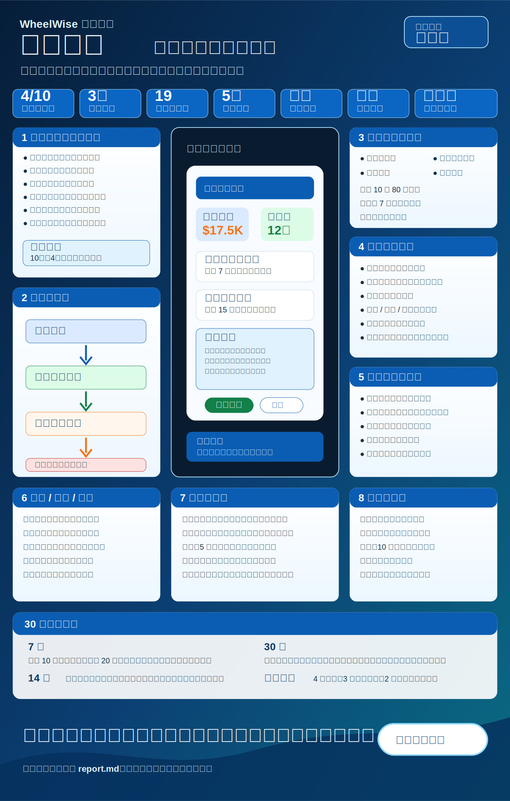

# 报告说明与阅读导览

输出文件夹：`examples/ai-payment-chaser/`

源报告：`report.md`

网页展示：`index.html`

资源目录：`assets/`

报告目的：
这是一份使用 WheelWise 完整流程生成的想法调研报告，用来判断“款到助手”是否值得继续推进，并让没有产品或技术背景的读者也能快速理解：这个想法解决什么问题、为什么有机会、产品应该长什么样、前端和后端如何实施、技术路线如何选择、如何拉新和运营。

适用阶段：
适用于立项前判断和首轮验证前准备。当前不是直接大规模开发阶段，而是先验证目标用户是否愿意把真实欠款发票交给工具处理，以及是否愿意为更省心的收款提醒付费。

核心结论预览：
建议结论是“先验证”。市场痛点真实，用户愿意减少尴尬催款的动机也明确，但同类工具和会计软件已经有提醒功能，因此必须验证差异化卖点：不是“又一个发票工具”，而是“不会伤客户关系、能由老板掌控语气和节奏的收款提醒助手”。

阅读方式：
先看结论、核心卖点和目标用户；再看市场证据、产品形态、前后端技术路线；最后看拉新运营和 7 天、14 天、30 天行动计划。

## 项目标题

项目名称：款到助手

输出文件夹：`examples/ai-payment-chaser/`

源报告：`report.md`

网页展示：`index.html`

资源目录：`assets/`

## 想法摘要

一句话描述：
款到助手是一个面向自由职业者、小型服务商和小型代理公司的智能收款提醒工具，帮助他们把逾期发票整理成可执行的提醒节奏，并生成礼貌、坚定、可人工确认的催款消息。

用户要完成的事情：
用户想知道哪些客户欠款、该什么时候提醒、该用什么语气提醒、提醒后有没有回应，以及下一步应该继续提醒、暂停、打电话还是升级处理。

产品承诺：
用一个清晰的看板，把“尴尬、零散、容易忘”的收款跟进变成“可控、有记录、能复盘”的流程。

主打卖点：
不伤客户关系地提高回款跟进效率。用户不是把催款完全交给机器，而是让工具先整理节奏、写好草稿、提示风险，再由自己确认发送。

当前判断：
问题真实且频率高，但竞品较多，首轮不应做完整财务系统。应该先做一个窄切口：导入发票、生成提醒、人工确认发送、追踪状态、复盘回款。

为什么可行：
它不是从零挑战成熟会计软件，而是抓住一个更窄、更情绪化、更容易被忽略的环节：逾期后如何持续、礼貌、可控地跟进。这个环节有明确现金流价值，也能用手动导入和人工确认先验证，不需要一开始就接入复杂系统。

可行之后的产品：
验证通过后，产品应成为一个轻量收款跟进工作台：用户每周打开一次，就能看到逾期客户、建议提醒语气、待确认消息、已发送记录和回款复盘。

## 交付形态

主要交付形态：
网页应用。

备选形态：
电子表格插件、浏览器插件、邮件插件。

形态约束：
首轮需要用户上传或导入发票、查看看板、编辑消息和确认发送，网页应用最适合快速验证。邮件插件更贴近日常工作，但权限和分发复杂度更高，应放到后续。

决策解释：

- 决策是什么：先做网页应用。
- 为什么选择它：账号、发票列表、提醒规则、发送记录和付款状态都需要持久化数据，网页应用能最快做出完整闭环。
- 为什么不选替代方案：浏览器插件和邮件插件更贴近工作流，但权限、审核和邮件平台限制会拖慢首轮验证；纯电子表格插件看起来轻，但不适合做发送审计和状态流转。
- 证据：现有竞品 Chaser 强调与会计系统集成和收款自动化，说明这个场景需要数据同步和流程看板；HoneyBook 的提醒功能也依赖项目和付款文件状态。
- 假设：早期用户愿意先手动上传发票或连接 Stripe、QuickBooks 中的一个来源。
- 风险：用户可能不愿意把客户和发票数据交给新工具。
- 兜底方案：先做“上传表格生成提醒计划”的轻量版本，不接入真实会计系统。
- 信心等级：中。

## 结论：构建最小可行产品 / 先验证 / 暂停 / 放弃

结论：
先验证。

信心等级：
中。

适用前提：
如果 10 个目标用户中至少 4 个愿意上传真实或脱敏的逾期发票，并愿意试用自动生成的提醒节奏，就进入最小可行产品开发；如果用户只说“听起来不错”但不愿意试真实流程，应暂停扩大开发。

决策解释：

- 决策是什么：先验证真实使用意愿，再开发完整产品。
- 为什么选择它：逾期收款痛点强，但市场已有 QuickBooks、FreshBooks、HoneyBook、Stripe、Chaser 等替代方案，差异化必须靠“关系安全”和“人工可控”证明。
- 为什么不选替代方案：直接开发完整产品会过早投入会计系统集成、邮件发送合规和付款状态同步；直接放弃又太早，因为逾期发票问题有强证据支持。
- 证据：Intuit QuickBooks 2025 年报告显示，超过一半受访美国小企业有未付发票，平均被欠款超过 1.7 万美元；Chaser、HoneyBook 和 Stripe 都提供不同层级的发票提醒或收款自动化功能，说明需求和市场都存在。
- 假设：目标用户最在意的不是“能不能提醒”，而是“提醒是否合适、是否不伤关系、是否可控”。
- 风险：如果用户已经满足于现有会计软件提醒功能，新工具会变成低优先级小功能。
- 兜底方案：转成“收款提醒文案和节奏生成器”，作为更轻的引流工具。
- 信心等级：中。

## 决策解释摘要

| 决策领域 | 决策是什么 | 为什么选择它 | 为什么不选替代方案 | 证据 | 假设 | 风险 | 兜底方案 | 信心等级 |
| --- | --- | --- | --- | --- | --- | --- | --- | --- |
| 推进结论 | 先验证 | 痛点强但竞品多 | 直接开发风险高 | QuickBooks 逾期付款报告、竞品功能 | 用户愿意试真实发票 | 信任门槛高 | 先做提醒计划生成器 | 中 |
| 交付形态 | 网页应用 | 最容易承载看板、规则、发送记录 | 插件权限复杂 | Chaser 和 HoneyBook 都围绕流程状态 | 用户接受网页登录 | 导入成本 | 表格上传版本 | 中 |
| 核心卖点 | 关系安全的收款提醒 | 小团队怕催款伤关系 | 单纯自动发送容易失控 | 用户讨论中反复出现自动提醒不透明和语气担忧 | 人工确认能提高信任 | 消息效果难证明 | 只做建议不自动发 | 中 |
| 技术路线 | 先自研提醒编排，购买邮件和支付能力 | 差异化在节奏和语气 | 自研支付和邮件浪费时间 | Stripe 和 Resend 等能力成熟 | 第三方接口稳定 | 供应商锁定 | 保留导出和替换边界 | 中 |
| 商业化 | 免费试用后按月订阅 | 小团队容易理解 | 按回款抽成争议大 | 竞品多采用订阅或平台费 | 用户愿为省时间付费 | 付费意愿未验证 | 按发票量阶梯 | 中 |

## 目标用户

主要用户：
1 到 20 人的小型服务商、自由职业者、小型设计/营销/开发代理公司、独立顾问。

早期用户：
每月开 10 到 80 张发票、经常有 7 天以上逾期款、但没有专职财务或催收人员的服务型团队。

购买者 / 决策者：
老板、合伙人、运营负责人或兼职财务。

使用场景：
每周一早上查看逾期发票，选择需要提醒的客户，调整语气，确认发送，然后在周五看哪些客户已付款、哪些需要升级处理。

## 问题与紧迫性

核心问题：
小团队的收款跟进常常靠记忆、邮件搜索和临时消息处理。问题不是不会开发票，而是发票逾期后没人稳定、礼貌、持续地跟进。

为什么现在需要解决：
现金流紧张会影响招聘、定价和经营稳定性。QuickBooks 2025 年报告显示，有逾期发票的小企业更容易遇到现金流问题，长期付款周期也和更高的现金流压力相关。

用户当前替代方案：
手动发邮件、使用 QuickBooks 或 FreshBooks 的提醒功能、用 HoneyBook 管项目和收款、用 Stripe 发票、购买 Chaser 这类应收账款自动化工具。

痛点强度：
中高。痛点很真实，但只有当用户每月逾期发票数量足够多、且现有工具提醒不够灵活时，才会形成强购买意愿。

## 市场备注

市场类别：
应收账款自动化、发票提醒、自由职业者收款管理、小型服务商运营工具。

竞品 / 替代品：

| 类型 | 代表方案 | 当前能力 | 对本想法的启示 |
| --- | --- | --- | --- |
| 会计软件 | QuickBooks、FreshBooks | 发票、付款、提醒、客户管理 | 基础能力成熟，不应从零做会计系统 |
| 支付和发票工具 | Stripe Invoicing | 发票、付款链接、发票收费 | 付款和发票基础设施应购买或集成 |
| 项目与客户管理 | HoneyBook | 项目文件、付款提醒、客户流程 | 创意服务商已经习惯在业务流程里看付款 |
| 应收账款自动化 | Chaser | 邮件提醒、短信提醒、付款门户、预测、集成 | 高阶市场存在，但对小团队可能过重 |
| 手动方案 | 邮件、表格、日历提醒 | 成本低但容易漏、难复盘 | 首轮可以从手动导入切入 |

市场信号：
Intuit QuickBooks 2025 年报告显示，美国小企业中有未付发票的企业平均被欠款超过 1.7 万美元，超过四成企业有部分发票逾期超过 30 天。Chaser 官网强调邮件提醒、短信提醒、付款门户、收款预测和会计系统集成，说明市场已经存在专业化供应。

需要继续调研的问题：
小型服务商愿意为“关系安全的提醒节奏”付多少钱；他们最常用的发票来源是 QuickBooks、Stripe、FreshBooks、HoneyBook 还是表格；他们是否愿意让工具代表自己发送邮件。

来源证据摘要：

| 来源 | 来源类型 | 关键发现 | 证据强度 | 影响的决策 |
| --- | --- | --- | --- | --- |
| Intuit QuickBooks 2025 小企业逾期付款报告，网址：`https://quickbooks.intuit.com/r/small-business-data/small-business-late-payments-report-2025/` | 公开研究 | 美国小企业逾期发票和现金流压力明显相关 | 高 | 痛点和市场存在性 |
| Chaser 官网，网址：`https://www.chaserhq.com/` | 竞品官网 | 已提供邮件提醒、短信提醒、付款门户、预测和会计系统集成 | 高 | 差异化和功能边界 |
| HoneyBook 帮助文档，网址：`https://help.honeybook.com/en/articles/2209077-send-manual-or-automatic-payment-reminders-in-honeybook` | 产品文档 | 支持自动和手动付款提醒，但有文件状态和发送限制 | 高 | 用户流程和产品约束 |
| FreshBooks 价格帮助文档，网址：`https://support.freshbooks.com/hc/en-us/articles/360006873232-What-is-the-pricing` | 官方帮助 | 提供试用和按客户数相关的套餐说明 | 中 | 定价参考 |
| Stripe 发票价格帮助文档，网址：`https://support.stripe.com/questions/stripe-invoicing-pricing` | 官方帮助 | 发票收费按已付款发票比例计费 | 中 | 支付和发票购买决策 |

## 用户假设

| 假设 | 为什么重要 | 当前证据 | 需要验证 |
| --- | --- | --- | --- |
| 用户害怕催款伤客户关系 | 这是核心卖点来源 | 社区讨论和手动提醒习惯显示用户在意语气与控制 | 访谈中询问最近一次催款如何写、是否拖延 |
| 用户愿意上传逾期发票 | 决定能否做产品闭环 | 现有会计工具已有导入和集成习惯 | 让 10 个用户上传脱敏样例 |
| 人工确认比全自动发送更可信 | 决定首版交互 | HoneyBook 文档显示手动提醒仍是重要场景 | 测试“先建议再确认”的使用率 |
| 用户愿意按月付费 | 决定商业化 | 同类工具存在订阅和按发票收费模式 | 落地页测试价格和试用转化 |

## 差异化

差异化主张：
款到助手不做“大而全财务系统”，而做“关系安全的收款提醒控制台”：既帮用户想好什么时候催、怎么催，又保留老板最后确认权。

不是差异化的部分：
发票生成、支付处理、基础邮件发送、用户登录、客户资料管理都不是差异化，应该购买或复用成熟能力。

可被用户感知的差异：
打开首页就能看到“谁欠款、该做什么、建议怎么说、是否需要升级处理”，并能选择“温和、正常、坚定”三种语气。

可防守性：
短期防守性不强，容易被会计软件模仿。真正的防守点来自行业模板、客户关系语气库、催款节奏数据和小团队运营习惯沉淀。

## 最小可行产品范围

范围内：

- 上传发票表格或手动创建逾期发票。
- 客户、金额、到期日、付款链接、联系人邮箱管理。
- 逾期看板：未到期、即将到期、已逾期、已暂停、已付款。
- 生成 3 步提醒节奏：到期前、逾期 3 天、逾期 10 天。
- 生成可编辑提醒文案，默认必须人工确认。
- 邮件发送记录、打开状态、用户备注。
- 简单回款复盘：本周提醒数、已付款金额、仍逾期金额。

范围外：

- 完整会计系统。
- 债务催收服务。
- 法律函件自动生成。
- 多币种税务和账务处理。
- 深度企业级审批流。

成功标准：
10 个目标用户中至少 4 个完成真实或脱敏发票导入，至少 3 个发送或复制提醒文案，至少 2 个表示愿意在价格不高于每月 19 美元时继续使用。

首轮验证对象：
美国和英语市场的小型服务商、自由职业者和 2 到 10 人代理公司。

## 产品策略

定位：
给小型服务商的收款提醒控制台，让老板不用每天翻邮箱，也不用硬着头皮临时写催款消息。

用户可见流程：
导入发票 -> 查看逾期看板 -> 选择客户 -> 查看建议节奏和文案 -> 调整语气 -> 确认发送 -> 查看回款和下一步建议。

功能优先级：

| 优先级 | 功能 |
| --- | --- |
| 必须 | 发票导入、逾期看板、文案生成、人工确认、发送记录 |
| 应该 | 付款链接、客户分组、提醒暂停、每周回款摘要 |
| 后续 | 会计系统双向同步、短信提醒、电话任务、团队权限 |

产品切入点：
“每周 15 分钟处理全部逾期发票”，而不是“自动化整个财务部门”。

优先验证内容：
用户是否愿意把真实欠款场景交给工具辅助；用户是否认为生成文案比自己写更省心；用户是否愿意为了减少尴尬和漏跟进付费。

产品假设：
小团队需要的是“可控提醒”，不是完全无人值守的自动催款。

决策解释：

- 决策是什么：先做轻量收款提醒控制台。
- 为什么选择它：它直接击中高频痛点，也避开完整会计系统的复杂度。
- 为什么不选替代方案：做完整发票和账务系统会与成熟工具正面竞争；只做文案生成器又缺少持续使用价值。
- 证据：竞品存在提醒和应收账款自动化能力，用户社区也有对自动提醒、提醒失控和流程不透明的讨论。
- 假设：人工确认不会显著降低效率，反而提高信任。
- 风险：如果用户只想要全自动，人工确认会显得麻烦。
- 兜底方案：允许用户把低风险客户设置为自动发送，高风险客户保留人工确认。
- 信心等级：中。

## 自研 / 购买 / 复用 / 分叉改造 / 参考决策

| 模块 | 决策 | 推荐方案 | 为什么选择它 | 为什么不选替代方案 | 证据 | 假设 | 风险 | 兜底方案 | 信心等级 |
| --- | --- | --- | --- | --- | --- | --- | --- | --- | --- |
| 用户登录 | 购买 | Clerk 或 Supabase Auth | 通用能力，安全要求高 | 自研登录浪费时间 | 登录不是差异化 | 用户接受第三方登录 | 成本随用户增长 | 可迁移到自托管认证 | 高 |
| 发票导入 | 自研 | 表格上传和字段映射 | 首轮需要贴近验证流程 | 直接做多系统集成太重 | 用户可能来源多样 | 表格足以启动验证 | 导入体验影响转化 | 先提供模板下载 | 中 |
| 会计系统同步 | 参考 | 参考 QuickBooks、Stripe、FreshBooks 集成方式 | 先理解字段和权限 | 首轮直接接太慢 | 竞品普遍强调集成 | 早期用户能手动导入 | 后续集成复杂 | 先接 Stripe 单向读取 | 中 |
| 提醒节奏引擎 | 自研 | 规则加智能文案 | 这是差异化核心 | 购买通用自动化难体现语气策略 | 用户痛点在可控跟进 | 规则能覆盖大部分场景 | 文案质量不稳定 | 提供模板选择 | 中 |
| 邮件发送 | 购买 | Resend、Postmark 或 SendGrid | 送达率和退信处理成熟 | 自建邮件基础设施风险高 | 邮件发送是标准能力 | 供应商可满足早期规模 | 账号信誉问题 | 支持连接用户邮箱 | 高 |
| 支付链接 | 购买 | Stripe Payment Links 或用户原有链接 | 支付处理高风险 | 自研支付不可取 | Stripe 发票已有成熟能力 | 用户已有付款方式 | 支付费率影响用户 | 只保存外部付款链接 | 高 |
| 前端组件 | 复用 | shadcn/ui、Tailwind CSS、Recharts | 快速做专业看板 | 从零写组件慢 | 看板和表单模式成熟 | 技术栈适配 | 样式同质化 | 加行业化文案和状态设计 | 高 |
| 视觉和演示 | 自研 | 静态网页展示和交互原型 | 需要解释产品价值 | 只写文字不够直观 | 用户需要快速理解流程 | 静态演示足够验证 | 不能证明真实发送 | 后续接入真实邮箱测试 | 中 |

## 技术实现路径

推荐技术栈：
Next.js、TypeScript、Tailwind CSS、shadcn/ui、Supabase、PostgreSQL、Resend、Stripe、OpenAI 接口、Vercel。

前端设计：
前端首页不是营销长页，而是产品工作台。左侧为导航：总览、发票、提醒队列、客户、设置。主区域顶部显示本周待处理金额、逾期发票数、已发送提醒数、已回款金额。核心页面是逾期看板和提醒编辑抽屉：用户点击一张发票后，右侧出现客户背景、建议语气、三步提醒节奏、可编辑正文和“确认发送”按钮。视觉风格应克制、可信、偏财务工具，但要用柔和颜色降低催款压力。

后端设计：
后端负责用户、组织、客户、发票、提醒计划、消息草稿、发送任务、发送日志和付款状态。提醒生成由后端调用智能模型完成，所有生成结果先进入待确认状态。发送服务独立处理排队、失败重试、退信记录和每日发送限制。支付状态首轮不做深度自动同步，先允许用户手动标记已付款。

高层架构：
浏览器访问 Next.js 前端；服务端接口读写 Supabase PostgreSQL；上传的表格经过字段映射后生成发票和客户；提醒引擎按到期日生成任务；智能文案服务生成草稿；邮件供应商发送确认后的消息；分析任务计算本周回款和逾期变化。

数据模型草图：

| 数据表 | 关键字段 | 用途 |
| --- | --- | --- |
| 组织 | 名称、行业、默认语气、发送邮箱 | 团队级设置 |
| 客户 | 名称、联系人、邮箱、关系标签 | 管理付款对象 |
| 发票 | 编号、金额、到期日、状态、付款链接 | 收款对象 |
| 提醒计划 | 发票、步骤、计划日期、语气、状态 | 控制提醒节奏 |
| 消息草稿 | 标题、正文、生成依据、人工修改记录 | 保障可审计 |
| 发送日志 | 时间、收件人、结果、错误 | 追踪发送和问题 |

数据流：
用户上传发票表格 -> 后端解析字段 -> 生成客户和发票 -> 规则引擎计算提醒步骤 -> 智能文案服务生成草稿 -> 用户编辑并确认 -> 邮件服务发送 -> 日志写入 -> 看板刷新状态。

接口与集成边界：
首轮只提供表格上传、邮件发送和外部付款链接保存。Stripe、QuickBooks、FreshBooks 只作为后续集成接口预留，不在首轮做深度同步。

集成方案：
Resend 或 Postmark 用于邮件；Stripe 用于付款链接或后续读取发票；Supabase 用于数据库和文件存储；OpenAI 接口用于生成提醒文案。

部署路径：
Vercel 部署前端和服务端接口，Supabase 托管数据库，定时任务可用 Vercel Cron 或 QStash，日志先写数据库，后续再接入专业监控。

交付形态约束：
网页应用必须强调数据安全和人工确认，默认不自动代表用户联系客户。所有发送动作都要有预览、确认和撤销窗口。

与复用决策的一致性：
登录、邮件、支付购买；前端组件复用；提醒策略和关系语气自研；会计系统集成先参考后实现。

决策解释：

- 决策是什么：先做轻量网页应用，后端以发票、提醒计划和发送日志为核心。
- 为什么选择它：能最快验证核心价值，同时避免完整财务系统复杂度。
- 为什么不选替代方案：一开始做多平台深度集成会拉长周期；只做静态文案工具又缺少状态闭环。
- 证据：Chaser 这类成熟工具强调会计系统集成和收款流程，说明长期方向需要数据闭环；首轮验证可以先用表格降低门槛。
- 假设：手动导入不会阻挡早期用户试用。
- 风险：发送邮箱和客户数据涉及信任，需要清晰权限和隐私说明。
- 兜底方案：先不发送邮件，只生成可复制的提醒文本和日程。
- 信心等级：中。

## 视觉说明

| 视觉标题 | 类型 | 解释内容 | 为什么帮助理解推荐方案 | 图片生成说明 / 制作方法 | 放置位置 |
| --- | --- | --- | --- | --- | --- |
| 款到助手产品概念图 | 产品概念图 | 发票导入、提醒生成、收款复盘三步流程 | 小白读者能一眼看懂产品不是会计系统，而是收款跟进控制台 | 使用本地矢量图制作，图片内文字为中文 | 源报告和网页展示 |

图片资产：



图表兜底：


## 交互演示

演示路径：
`examples/ai-payment-chaser/index.html` 和 `examples/ai-payment-chaser/prototype.html`

运行方式：
直接打开 `index.html` 阅读完整展示层；直接打开 `prototype.html` 体验产品工作台交互原型。

交互原型文件：
`prototype.html`

核心交互：
展示层包含封面、核心结论、决策地图、产品工作台截面、技术路线、商业化和执行计划。交互原型包含发票导入、逾期看板、提醒草稿编辑、语气切换、确认发送、发送日志和已付款标记。

页面 / 屏幕 / 模拟器面板：

| 页面 | 目的 | 核心交互 | 状态 |
| --- | --- | --- | --- |
| 总览 | 看本周收款压力 | 查看逾期金额和待处理客户 | 加载、空列表、正常、错误 |
| 发票导入 | 把现有发票带入系统 | 上传表格、映射字段、预览错误 | 上传中、字段缺失、导入成功 |
| 提醒队列 | 决定今天提醒谁 | 筛选客户、选择语气、批量确认 | 无待处理、部分失败、发送成功 |
| 消息编辑 | 控制提醒语气 | 编辑正文、查看依据、确认发送 | 草稿、已修改、发送失败 |
| 回款复盘 | 看提醒效果 | 标记已付款、查看本周变化 | 无数据、已付款、仍逾期 |

模拟数据说明：
展示层使用示例客户、示例金额和示例状态，不连接真实后端。

加载 / 空状态 / 错误 / 成功状态：
产品原型必须覆盖上传中、无逾期发票、字段解析错误、邮件发送失败、提醒发送成功和发票已付款。

未接入真实后端的范围：
当前示例没有真实登录、邮件发送、付款同步、智能文案生成和会计系统同步。

网页展示文件：
`index.html`

交互原型文件：
`prototype.html`

网页展示用途：
网页是展示层，内容来自源报告 `report.md`，方便快速展示结论、流程和实施路径，不是第二套事实来源。

## 网页展示文件

默认文件：
`index.html`

生成状态：
已生成。

用途：
网页是展示层，用来呈现封面、核心结论、决策地图、路线图、视觉说明、演示截面、风险与验证、执行计划；`report.md` 仍是源报告。

生成方式：
使用静态 HTML、CSS 和少量前端脚本，把源报告重新设计为有视觉海报、指标卡、流程图、时间线、风险矩阵和完整正文的展示页，不是简单把 Markdown 标题和表格转成网页。所有面向读者的文字使用中文。

交互原型：
`prototype.html` 用本地模拟数据展示产品工作台，包含逾期看板、提醒草稿、语气切换、发送确认和回款标记。

## 商业化备注

商业模式：
免费试用加按月订阅。建议首轮价格假设为个人版每月 9 到 19 美元，小团队版每月 29 到 49 美元。不要按回款金额抽成，避免用户觉得工具在“分走欠款”。

定价或包装假设：
免费版允许导入 10 张发票并生成提醒草稿；个人版支持每月 100 张发票和邮件发送；小团队版支持团队成员、客户分组、每周回款报告和更多发送额度。

获客渠道：
第一优先渠道是内容和工具引流：发布“逾期发票提醒节奏生成器”“催款邮件模板库”“小型服务商回款检查表”。第二优先渠道是会计师、记账服务商和自由职业者社区合作。第三优先渠道是围绕 QuickBooks、Stripe、FreshBooks 使用场景做搜索内容。

用户激活：
新用户 5 分钟内必须完成一件事：上传一张逾期发票并得到 3 条可复制的提醒文案。激活指标不是注册，而是“生成并保存第一条提醒计划”。

留存与运营：
每周一发送“本周待跟进客户”摘要，每周五发送“本周回款复盘”。运营重点不是每天打扰用户，而是帮用户形成固定收款习惯。

首月运营节奏：
第 1 周访谈 10 个用户并手工生成提醒计划；第 2 周上线落地页和免费工具；第 3 周邀请 20 个种子用户试用；第 4 周根据发送率、回款标记率和付费意愿决定是否继续开发。

早期变现测试：
落地页同时测试 9 美元、19 美元、29 美元三个价格锚点；访谈中询问用户是否愿意为“每周节省 1 小时并减少漏催”付费。

决策解释：

- 决策是什么：先用订阅制验证，不做回款抽成。
- 为什么选择它：小团队容易理解月费，且不会担心工具拿走回款比例。
- 为什么不选替代方案：按发票收费会增加心理负担；按回款抽成会引发信任和归因争议。
- 证据：FreshBooks、HoneyBook 等工具采用套餐或会员模式，Stripe 发票则按已付款发票比例收费，说明市场可以接受多种价格方式，但本产品更适合先用简单订阅。
- 假设：用户愿意为省时、减少尴尬和减少漏跟进付费。
- 风险：如果用户认为现有会计软件提醒已经够用，付费转化会低。
- 兜底方案：先卖一次性“回款流程设置服务”，再沉淀成软件。
- 信心等级：中。

## 关键风险

| 风险 | 类别 | 严重程度 | 可能性 | 缓解方式 |
| --- | --- | --- | --- | --- |
| 竞品已有基础提醒 | 市场 | 高 | 高 | 聚焦关系安全、人工确认和小团队易用性 |
| 用户不愿授权发票和客户数据 | 隐私 | 高 | 中 | 首轮支持脱敏表格和只生成文案 |
| 邮件发送影响客户关系 | 产品 | 高 | 中 | 默认人工确认，提供预览和发送日志 |
| 智能文案语气不合适 | 产品 | 中 | 中 | 提供模板、语气选择和人工编辑 |
| 会计系统集成复杂 | 技术 | 中 | 高 | 首轮只做表格导入，后续单点集成 |
| 付费意愿不足 | 商业 | 高 | 中 | 先做价格测试和手工服务验证 |

## 验证实验

| 实验 | 验证内容 | 方法 | 成功标准 | 失败后的处理 |
| --- | --- | --- | --- | --- |
| 逾期发票导入测试 | 用户是否愿意使用真实流程 | 找 10 个目标用户上传脱敏发票 | 4 人完成导入 | 改成只复制粘贴发票信息 |
| 提醒文案偏好测试 | 语气建议是否有价值 | 为每个用户生成 3 种语气文案 | 6 人选择并编辑其中一种 | 转成模板库 |
| 发送意愿测试 | 用户是否信任工具代表自己提醒 | 让用户选择复制发送或系统发送 | 3 人愿意系统发送 | 保持只生成不发送 |
| 价格测试 | 用户是否愿付费 | 落地页展示 3 个价格档 | 10% 访客留下邮箱或预约 | 改成一次性设置服务 |
| 渠道测试 | 哪个渠道能拉来早期用户 | 发布模板、检查表和案例拆解 | 每周 20 个有效线索 | 调整定位到会计师渠道 |

## 可交给 Codex 执行的计划

### 里程碑 1：报告和展示层固化

目标：
把本报告、网页展示和视觉资产保持为可复用示例。

任务：
创建或更新 `examples/ai-payment-chaser/report.md`、`examples/ai-payment-chaser/index.html` 和 `examples/ai-payment-chaser/assets/concept.svg`。

文件 / 模块：
示例报告目录。

测试：
运行报告契约检查。

验收标准：
目录包含源报告、网页展示和资源目录；报告包含全部中文章节；网页展示内容来自源报告。

可直接交给 Codex 的提示词：
根据 `examples/ai-payment-chaser/report.md` 生成同目录展示网页，确保网页只展示报告中的中文结论、产品流程、技术路线和执行计划。

视觉说明任务：
维护 `assets/concept.svg`，图中只出现中文文字。

交互演示任务：
后续新增一个静态原型，包含发票导入、提醒队列和消息编辑三个核心界面。

网页展示文件任务：
更新 `index.html`，保持展示层来自 `report.md`。

源报告任务：

```text
生成或更新 examples/ai-payment-chaser/report.md，确保报告正文全中文、结构递进，并包含视觉说明、交互演示、网页展示文件记录、决策解释、风险、验证实验和可交给 Codex 执行的计划。
```

### 里程碑 2：可点击原型

目标：
做出无需真实后端的产品原型，让用户能体验逾期发票处理流程。

任务：
实现总览、发票导入、提醒队列、消息编辑、回款复盘页面；使用本地示例数据；支持语气切换、确认发送模拟和状态变化。

文件 / 模块：
`prototype/` 静态原型或独立前端应用。

测试：
桌面和手机宽度截图检查；确认空状态、错误状态、成功状态都能看到。

验收标准：
用户能在 3 分钟内理解产品价值，并完成“选择发票 -> 编辑提醒 -> 确认发送 -> 标记已付款”的流程。

可直接交给 Codex 的提示词：
在 `examples/ai-payment-chaser/prototype/` 下实现一个静态前端原型，所有可见文字使用中文，模拟数据写在本地文件中，不连接真实后端。

### 里程碑 3：真实验证版本

目标：
让 10 到 20 个种子用户试用真实导入和提醒生成。

任务：
搭建 Next.js 项目；接入登录、数据库、表格上传、提醒规则、智能文案生成、邮件草稿和发送日志。

文件 / 模块：
前端工作台、服务端接口、数据库迁移、邮件发送服务、文案生成服务。

测试：
发票导入单元测试、提醒计划生成测试、邮件发送失败重试测试、权限隔离测试。

验收标准：
用户能上传发票、生成提醒、编辑文案、发送或复制提醒、查看日志和标记已付款。

可直接交给 Codex 的提示词：
基于本报告的技术路线，实现款到助手验证版，优先完成表格导入、逾期看板、提醒草稿、人工确认和发送日志，不实现完整会计系统同步。

## 最终建议与下一步行动

一句话判断：
这个想法值得继续，但应该先验证“关系安全的收款提醒”是否能让小团队真的上传发票、发送提醒并愿意付费。

7 天行动：
完成 10 个目标用户访谈，收集 20 条真实或脱敏逾期发票样例，手工生成提醒节奏并观察用户是否愿意使用。

14 天行动：
上线落地页、提醒文案生成器和静态原型，测试三个价格档和两个卖点表达：“少漏催”和“不伤客户关系”。

30 天行动：
如果验证通过，开发真实验证版本；如果没有足够用户愿意上传发票，则缩小为模板库和一次性回款流程设置服务。

继续 / 停止条件：
继续条件是 10 个目标用户中至少 4 个完成导入，至少 3 个使用提醒文案，至少 2 个愿意付费或预约后续试用。停止条件是用户承认痛点但不愿提供发票、不愿使用生成文案，或认为现有工具已经足够。
