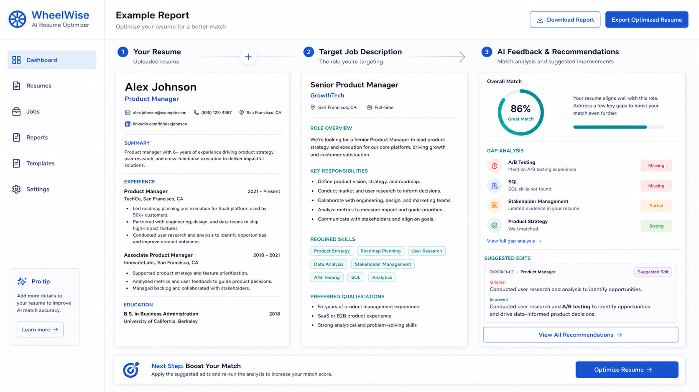

# 报告说明与阅读导览

报告文件：`wheelwise-report-ai-resume-optimizer.md`

报告目的：
评估“AI 简历优化工具”是否值得做成产品，明确交付形态、核心差异化、复用策略、视觉 / Demo 方案和 Codex-ready 执行计划。

适用阶段：
适用于 idea 早期验证阶段，尤其是还没有证明求职者愿意持续使用或付费之前。

核心结论预览：
建议先验证，不建议直接做完整 SaaS。核心切口应从“泛泛修改简历”收敛为“针对一个岗位快速生成可解释的修改建议与投递版本”。

阅读方式：
先读结论、交付形态和 MVP 范围，再看 Build / Buy / Reuse / Fork / Reference 决策，最后看 Demo、验证实验和 7/14/30 天行动。

## 项目标题

项目名称：AI 简历优化工具

报告文件：`wheelwise-report-ai-resume-optimizer.md`

## 想法摘要

为求职者提供一个 Web App：用户上传简历并粘贴目标岗位 JD，系统给出匹配度、缺口、改写建议和可导出的优化版本。

## 交付形态

主要交付形态：Web App。

备选形态：营销网站 + 表单、浏览器插件、桌面 App。

形态约束：用户需要上传文件、保存历史、对比版本和可能付费，因此 Web App 比单页网站更合适。

## 结论：构建 MVP / 先验证 / 暂停 / 放弃

结论：先验证。

原因：需求真实但赛道拥挤，差异化和付费意愿必须先被证明。

## 决策解释摘要

| 决策领域 | 决策是什么 | 为什么选择它 | 为什么不选替代方案 | 信心等级 |
| --- | --- | --- | --- | --- |
| 结论 | 先验证 | 类别拥挤，直接做完整 SaaS 风险高 | 直接构建 MVP 可能浪费认证、计费、历史记录等工程投入 | 中 |
| 交付形态 | Web App | 适合上传、分析、保存和导出 | 插件和桌面端初期分发成本更高 | 高 |

## 目标用户

主要用户是正在投递岗位的应届生、转行者和白领求职者。早期用户应选择愿意提供真实 JD 与简历反馈的人群。

## 问题与紧迫性

用户的问题不是“不知道怎么写简历”，而是“不知道这份简历对这个岗位哪里不匹配、怎么改才更可能通过筛选”。紧迫性来自投递窗口短、岗位竞争激烈和用户缺少反馈。

## 市场备注

市场已有大量简历生成、ATS 检查和 AI 改写工具。机会不在通用生成，而在更强的岗位匹配解释、可追踪改动和真实投递结果反馈。

## 用户假设

| 假设 | 为什么重要 | 当前证据 | 需要验证 |
| --- | --- | --- | --- |
| 用户愿意上传真实简历 | 决定产品能否获得有效输入 | 求职场景强需求 | 隐私担忧是否阻碍使用 |
| 用户愿意为高质量改写付费 | 决定商业化 | 简历服务已有付费市场 | AI 工具付费意愿 |

## 差异化

差异化应放在“针对具体 JD 的可解释匹配与改写”，而不是泛泛生成模板。系统要告诉用户为什么改、改哪里、改完后匹配度如何变化。

## MVP 范围

范围内：上传简历、粘贴 JD、匹配评分、缺口说明、修改建议、导出优化文本、收集用户反馈。

范围外：完整账号体系、复杂模板商城、自动投递、长期职业规划。

## 产品策略

定位：面向求职者的岗位定向简历优化工具。

产品切入点：用一次明确的岗位投递场景证明价值。

优先验证内容：用户是否相信建议、是否愿意按建议修改、是否愿意为导出或深度修改付费。

## Build / Buy / Reuse / Fork / Reference 决策

| 模块 | 决策 | 推荐方案 | 为什么选择它 | 为什么不选替代方案 | fallback |
| --- | --- | --- | --- | --- | --- |
| 认证 | Buy | Supabase Auth 或 Clerk | 通用基础设施 | 自研认证风险高 | MVP 可先不用账号 |
| 支付 | Buy | Stripe Checkout | 支付不是差异化 | 自研支付不可取 | 先做人工收款验证 |
| 文档解析 | Reuse | 成熟解析库或 API | 节省时间 | 自研解析复杂且不核心 | 先限制 PDF/DOCX 格式 |
| 反馈逻辑 | Build | 自有 prompt 与评分标准 | 核心差异化 | 纯套壳难形成信任 | 先人工复核 |

## 技术实现路径

推荐技术栈：Next.js、React、文件上传、文档解析库、AI API、Postgres 或轻量存储。

高层架构：前端上传简历和 JD，后端解析文档并生成结构化输入，AI 生成匹配解释和改写建议，前端展示对比和导出。

## 视觉说明

图片资产：

```markdown

```

Mermaid fallback：


## UI Demo / 交互 Demo

Demo 路径：`demo/ai-resume-optimizer/index.html`

运行方式：直接打开 HTML 文件，或用本地静态服务器预览。

核心交互：上传简历、粘贴 JD、点击分析、查看 loading / empty / error / success 状态、切换原文与建议版本。

mock 数据说明：使用本地 JSON 保存示例简历、岗位 JD、匹配评分和修改建议。

loading / empty / error / success 状态：必须覆盖分析中、未上传文件、解析失败、成功生成建议。

未接入真实后端的范围：文档解析、AI 调用、账号、支付和历史记录均用模拟数据。

## HTML 展示文件

默认文件：`wheelwise-report.html`

用途：HTML 是展示层，内容来自 Markdown 报告，用于展示封面、核心结论、决策地图、MVP 路线图、视觉说明、Demo 截面、风险与验证、执行计划。

生成状态：建议生成。

## 商业化备注

早期可以测试一次性报告付费、订阅导出、高级改写包或人工复核服务。不要先构建复杂会员体系。

## 关键风险

| 风险 | 类别 | 严重程度 | 可能性 | 缓解方式 |
| --- | --- | --- | --- | --- |
| 同质化严重 | 市场 | 高 | 高 | 聚焦岗位定向匹配解释 |
| 隐私顾虑 | 隐私 | 高 | 中 | 明确删除机制和本地预览 |
| 建议质量不稳定 | 产品 | 高 | 中 | 人工复核早期样本 |

## 验证实验

| 实验 | 验证内容 | 方法 | 成功标准 | 失败后的处理 |
| --- | --- | --- | --- | --- |
| 10 人简历改写测试 | 建议是否可信 | 收集真实简历和 JD，生成建议并访谈 | 6 人以上愿意按建议修改 | 缩小目标用户或转人工服务 |

## Codex-ready 执行计划

里程碑 1：验证 landing + Demo。

任务：搭建单页 Demo、加入 mock 数据、实现四种状态、写入报告和 HTML 展示任务。

Markdown 报告任务：

```text
生成或更新 wheelwise-report-ai-resume-optimizer.md，确保正文全中文并包含视觉说明、Demo 说明、HTML 展示文件记录和最终行动建议。
```

HTML 展示文件任务：

```text
生成 wheelwise-report.html，作为 Markdown 报告的静态展示层。
```

## 最终建议与下一步行动

一句话判断：先验证岗位定向简历优化是否能让用户相信并愿意付费，再决定是否构建完整 SaaS。

7 天行动：做一个可点击 Demo，找 5 个真实求职者测试上传、分析和建议可信度。

14 天行动：补齐文档解析、建议质量评估和导出流程，测试一次性付费或人工复核。

30 天行动：根据转化和反馈决定是否加入账号、历史记录和支付。

go/no-go 条件：如果 10 个用户中至少 4 个愿意为结果付费或留下强复用意愿，则继续；否则暂停完整 SaaS，转向轻量服务或细分人群验证。

继续/停止条件：继续条件是用户愿意上传真实材料并按建议修改；停止条件是用户只把它当免费一次性工具且不信任输出。
