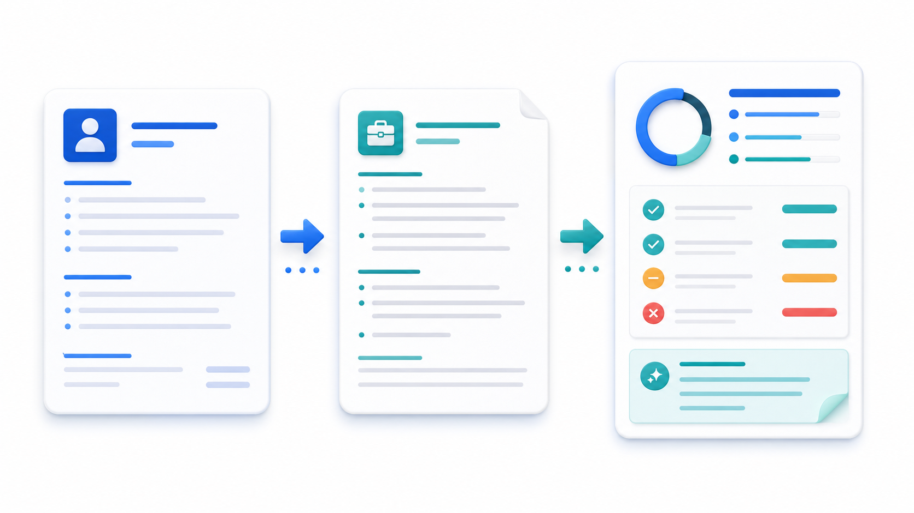

# 报告说明与阅读导览

报告目的：本报告评审的是“AI 简历优化器”是否值得在正式开发前继续推进。它的目的不是证明这个产品一定成立，而是判断当前证据支持到哪个阶段：哪些判断可以作为事实或合理推断使用，哪些仍只是关于求职者行为、隐私信任和付费意愿的假设，哪些缺口会直接改变下一步决策。

适用阶段：这份预评审适用于原型验证前后。能做什么与不能替代什么：WheelWise 能帮助整理判断链、证据边界和下一步验证，但不替代真实求职者访谈、招聘平台规则确认、个人信息保护审查、投资判断或团队立项决策。核心结论预览：当前建议进入原型验证，但不进入完整最小可行产品实验。阅读方式：先看预评审结论、核心判断逻辑和最终建议，再看证据等级、竞品替代、验证计划和技术范围。

交付文件夹为 `examples/ai-resume-optimizer/`，源报告为 `report.md`，网页展示为 `index.html`，交互原型为 `prototype.html`，资源目录为 `assets/`，内部状态和证据分别记录在 `project-state.md` 与 `evidence-board.md`。

## 项目标题

本次预评审对象是 AI 简历优化器，一个帮助求职者把简历内容与目标岗位要求对齐的网页应用想法。当前报告将它视为“求职工作流工具”而不是单纯的文本改写器，因为它能否成立取决于用户是否感到建议更贴近岗位，而不是模型是否能生成漂亮句子。

## 预评审结论

本 idea 的预评审状态是 **可进入原型验证**。下一阶段建议是先做岗位化建议原型，而不是完整产品。为什么是当前状态：目标用户、关键任务和交付形态已经足够清晰，用户可以通过上传简历、选择岗位、查看差距和接受改写建议来体验核心价值；但真正决定产品是否值得继续的是建议质量、隐私信任和差异化感知，这些还没有真实用户证据支撑。

为什么不是更激进状态：现在还不能进入最小可行产品实验，因为付费意愿、留存频率、真实岗位匹配效果和隐私接受度都没有被验证；如果直接做完整账号、支付、简历库和模型后端，很容易把工程投入花在用户未必愿意反复使用的流程上。为什么不是更保守状态：问题场景明确，替代行为也清楚，低成本原型足以测试价值感知，因此没有必要停留在纯调研或放弃判断。

升级条件是，至少 8 位目标求职者在原型测试中认为岗位化建议明显优于自己用通用工具改写，并愿意二次上传或留下联系方式。降级或停止信号是，用户只把它当一次性润色器、拒绝上传真实简历、无法分辨它和通用聊天工具的差异，或认为建议会损害简历真实性。

关键支持证据来自求职者需要简历反馈、岗位描述与简历之间存在明确匹配任务、网页原型可以低成本表达核心流程。关键反驳证据是通用聊天工具、招聘平台附带工具和人工简历服务都能替代部分能力。最高影响证据缺口是目标用户是否愿意为了“更贴近岗位且可解释的建议”持续使用或付费；关键假设是用户愿意在清晰隐私边界下提供简历片段并评价建议质量。

## 核心判断逻辑

这个 idea 为什么值得继续推进到原型验证，不是因为“AI 改简历”本身新，而是因为求职者在投递前确实需要判断简历是否贴合具体岗位。用户当前往往依赖朋友反馈、简历模板、人工服务或通用聊天工具，这些替代方案能解决润色问题，却不一定能稳定解释岗位关键词、经历取舍和风险表达。因此，机会不在泛化改写，而在把“岗位要求到简历修改”的判断过程做得更具体、更可解释、更让用户放心。

当前结论主要基于推断和少量稳定事实：简历包含个人信息是事实，求职者需要反馈是合理推断，岗位化建议能形成差异化仍是假设。最大风险不是技术不可行，而是用户觉得建议泛化、不信任上传隐私材料，或者认为通用工具已经足够。这个证据缺口会影响产品定位、收费方式和技术范围，所以不能把它写成已经成立的商业机会。

下一步验证最合适的动作是原型验证，而不是直接开发最小可行产品，也不是继续泛泛访谈。原型能让用户在真实简历片段和目标岗位之间做选择，直接暴露他们是否理解建议、是否愿意采纳、是否担心隐私、是否认为差异化足够明显。这个测试能用很小成本验证最大不确定性，并决定后续是做岗位化简历工作流、转向免费求职辅助，还是只保留简历诊断模块作为参考。

## 执行摘要

本报告建议先进入原型验证，验证对象是正在找工作、愿意用真实或半真实简历材料测试工具的应届生与转岗人群。当前证据足以支持一个可点击网页原型，但不足以支持完整产品开发、收费系统或复杂后端建设。

最关键证据是用户任务清晰：他们需要把经历表达调整到岗位要求。最关键证据缺口是用户是否认为岗位化建议显著优于通用聊天工具，并愿意在隐私边界清晰的情况下重复使用。若原型测试无法证明这一点，项目应转向更轻的求职材料检查器或作为参考模块保留。

## 原始想法与关键假设

原始想法是做一个完整的 AI 简历优化网页应用，帮助用户上传简历、输入岗位描述并获得诊断和改写建议。预评审将这个想法拆成几个假设：目标用户是应届生和转岗人群，关键任务是提高简历与岗位的匹配度，交付形态适合网页应用，商业化可能来自按次优化、会员或求职包。

这些假设里，网页交付和文本处理可行性较强，用户隐私接受度、建议质量感知和付费意愿较弱。当前数据足够做原型验证，不足以支持最小可行产品实验。

## 调研方法与证据等级

本示例没有执行实时搜索，因此市场和竞品部分只作为预评审样板，不作为当前市场事实。证据主要来自产品推断、替代方案分析和风险常识；商业化、留存和真实求职行为均需后续补证。

| 证据项 | 数据来源 | 证据类型 | 证据分类 | 影响的结论 | 证据强度 | 信心等级 | 缺口 |
| --- | --- | --- | --- | --- | --- | --- | --- |
| 简历包含个人信息 | 合规常识 | 风险 | 事实 | 需要隐私边界 | 高 | 高 | 缺正式合规审查 |
| 求职者需要岗位化反馈 | 产品推断 | 用户需求 | 推断 | 支持原型验证 | 中 | 中 | 缺真实访谈 |
| 通用聊天工具可替代润色 | 替代方案分析 | 竞品替代 | 推断 | 差异化必须验证 | 中 | 中 | 缺当前竞品调研 |
| 付费意愿未知 | 未验证 | 商业化 | 证据缺口 | 阻止最小可行产品实验 | 高 | 低 | 需付费信号测试 |

这组证据说明：技术可行性不是主要瓶颈，真正决定状态的是用户是否感知到岗位化流程的额外价值。

## 评审委员会意见

评审委员会的共识是：这个 idea 不应停在纸面研究，也不应直接进入产品开发。产品、技术和视觉视角都支持做原型；市场、商业化和风险视角提醒它会被通用工具替代，且隐私信任是高优先级缺口。

| 评审视角 | 核心判断 | 证据分类 | 支持证据 | 反驳证据 / 缺口 | 下一步验证 |
| --- | --- | --- | --- | --- | --- |
| 产品 | 岗位化流程可测试 | 推断 | 任务链清晰 | 建议可能泛化 | 原型测试建议采纳率 |
| 市场 | 需求存在但竞争拥挤 | 推断 | 求职场景普遍 | 替代工具多 | 当前竞品调研 |
| 用户 | 早期用户可定位 | 假设 | 应届生和转岗人群 | 缺真实访谈 | 招募 8 位测试者 |
| 技术 | 原型实现成本低 | 事实 | 文本流程可模拟 | 模型质量未测 | 提示词探针 |
| 复用 | 可复用模型接口 | 推断 | 通用能力成熟 | 隐私处理需设计 | 对比本地与云端方案 |
| 商业化 | 暂不承诺收费 | 证据缺口 | 有潜在付费点 | 付费意愿未知 | 价格敏感度访谈 |
| 风险 | 隐私和真实性最高 | 事实 | 简历含个人信息 | 合规未审 | 数据边界说明测试 |
| 执行 | 先做原型最合适 | 推断 | 范围小、反馈快 | 缺真实指标 | 7 天原型实验 |
| 视觉 / 原型 | 需展示诊断闭环 | 推断 | 用户可感知流程 | 质量未验证 | 可点击流程测试 |

## 目标用户与使用场景

主要用户是正在密集投递岗位、但缺少高质量反馈的应届生和转岗求职者。早期用户应优先选择愿意带着真实岗位和简历片段参与测试的人，因为他们能判断建议是否真正影响投递材料，而不是只评价文字是否好看。

他们当前会问朋友、购买人工简历服务、套模板或使用通用聊天工具。这个替代行为决定了采用阻力：产品必须证明自己比通用工具更贴近岗位，比人工服务更低成本，并且比直接上传给陌生服务更可信。

## 问题痛点与需求强度

问题强度处于中等偏上，但不是无条件强。求职者确实需要反馈，尤其是在不知道如何把经历对应到岗位要求时；然而他们也有大量低成本替代方案，因此痛点能否转化为持续使用取决于建议是否具体、可解释、可采纳。

最大的采用阻力是隐私和泛化感。用户可能愿意试一次，但如果建议像通用模板，或需要上传过多个人信息，就会迅速回到聊天工具和朋友反馈。该判断目前是推断，必须通过原型测试补证。

## 市场吸引力与机会窗口

这个市场属于求职工具与个人生产力交叉领域，需求广但竞争也拥挤。机会窗口不在“AI 能改写文本”，而在把岗位描述、简历经历、风险提示和修改理由组织成一个可信工作流。

市场吸引力目前只能给中等评价。它有明确使用场景，但差异化和获客成本尚未验证；如果无法证明岗位化流程带来可感知提升，该 idea 会被通用聊天工具压缩成低价值功能。

## 竞品与替代方案分析

最强替代方案是通用聊天工具，因为它成本低、易获得、已经能完成润色和改写。人工简历服务在个性化上更强，招聘平台工具在岗位数据上更贴近。本 idea 必须证明自己在“可解释的岗位匹配建议”上形成清晰优势。

| 竞品 / 替代方案 | 目标用户 | 核心能力 | 价格 / 成本 | 优势 | 弱点 | 对本想法的启示 | 证据来源 |
| --- | --- | --- | --- | --- | --- | --- | --- |
| 通用聊天工具 | 求职者 | 文本润色 | 低 | 易获得 | 缺岗位工作流 | 必须突出岗位化解释 | 替代分析 |
| 人工简历服务 | 高意愿求职者 | 深度修改 | 高 | 个性化强 | 成本高 | 可做低成本初筛 | 替代分析 |
| 招聘平台工具 | 平台用户 | 简历建议 | 中 | 接近岗位数据 | 平台绑定 | 需跨平台定位 | 证据缺口 |

如果用户无法说出本工具相较通用聊天工具的具体好处，原始方向就应降级。

## 原始方向校准

原始方向“做完整 AI 简历优化产品”需要收窄为“先验证岗位化诊断和建议采纳”。支持原方向的是用户任务清晰、网页原型可表达；反驳原方向的是替代工具强、隐私风险高、商业化证据不足。

推荐方向没有改变目标用户，但改变了推进方式：先做原型验证而不是最小可行产品实验。偏移程度为轻微，不需要用户额外确认。

## 产品定位与差异化

产品定位应是“面向具体岗位的简历诊断与修改建议工具”，而不是泛用 AI 文本润色器。差异化应体现在岗位要求拆解、经历匹配解释、风险提示和修改前后对比，而不是简单生成更漂亮的表达。

可被用户感知的差异是：他能知道为什么要改、改哪里、改后是否更贴近岗位。可防守性目前较弱，需要通过工作流、隐私边界和岗位化数据积累来增强。

## 最小可行产品范围

当前阶段不应做完整产品，而应做原型验证范围。范围内包括简历片段输入、岗位描述输入、匹配度诊断、建议解释、改写前后对比和隐私提示；范围外包括账号系统、支付、真实文件存储、招聘平台集成和批量投递。

首轮成功标准是用户能理解建议、愿意采纳至少一条修改、认为它比通用工具更贴近岗位，并愿意再次使用。停止条件是用户无法感知差异或拒绝在清晰隐私说明下继续测试。

## 商业模式与获客假设

商业化目前只能作为假设。可能路径包括按次优化、求职包、会员或与求职社群合作，但这些都依赖用户是否愿意反复使用，而非一次性试用。

早期获客应通过求职社群、学校就业群、转岗社群和职业咨询内容触达。当前不应优先做价格页，而应在原型测试后询问用户愿意为哪类结果付费。

## 合规与上线前置项

简历包含姓名、联系方式、教育经历、工作经历等个人信息，因此即使只是原型，也要给出清晰的数据边界。本报告不构成法律意见，正式上线前需要确认隐私政策、用户协议、个人信息保护、数据保存周期、模型调用方式和删除机制。

经营主体、备案、平台规则和数据处理责任在上线前必须确认。原型阶段可用脱敏文本、用户自愿粘贴片段和本地模拟数据，暂不接入真实账号和长期存储。若后续收集真实简历或收费，必须进一步确认备案、平台规则和数据处理合规要求。

## 关键风险与不确定性

最大风险是用户认为建议泛化，导致本产品退化成通用聊天工具的外壳。第二个风险是隐私不信任，用户即使有需求也不愿上传材料。第三个风险是商业化过早，用户愿意试用但不愿持续付费。

| 风险 | 类别 | 严重程度 | 可能性 | 数据来源 | 影响 | 缓解方式 |
| --- | --- | --- | --- | --- | --- | --- |
| 建议泛化 | 产品 | 高 | 中 | 推断 | 差异化失败 | 原型测试岗位化感知 |
| 简历隐私顾虑 | 合规 / 信任 | 高 | 中 | 事实 + 推断 | 上传率低 | 脱敏与删除机制 |
| 付费意愿不足 | 商业化 | 中 | 高 | 证据缺口 | 无法进入实验 | 价格敏感度访谈 |

## 决策记录与选项排除

本次评审考虑了完整开发、原型验证、继续纯调研和放弃四个方向。当前建议选择原型验证，因为它能直接测试价值感知和隐私信任；排除完整开发是因为商业和留存证据不足；排除纯调研是因为可交互流程已足够低成本。

| 决策 | 当前建议 | 考虑过的选项 | 被排除的选项 | 排除原因 | 依赖的关键假设 | 假设失效后的动作 | 下一步验证 |
| --- | --- | --- | --- | --- | --- | --- | --- |
| 预评审状态 | 可进入原型验证 | 开发 / 补证 / 放弃 | 完整开发 | 付费和留存证据不足 | 用户能感知岗位化价值 | 转向轻量诊断 | 原型测试 |
| 交付形态 | 网页原型 | 网页 / 插件 / 小程序 | 插件 | 安装阻力高 | 网页足以测试 | 转向社群工具 | 可点击测试 |
| 商业化路径 | 暂缓定价 | 按次 / 会员 / 免费 | 立即收费 | 价值未证实 | 用户愿意复用 | 保留免费入口 | 付费访谈 |

## 横向比较评分

以下评分用于多个 idea 的相对预评审比较，不是投资排序、审批结论或成功率承诺。AI 简历优化器的优势在问题清晰和技术可行，短板在差异化、证据充分度和商业化可行性。

| 评分维度 | 评分 | 证据分类 | 评分依据 | 证据缺口 | 下一步验证 |
| --- | --- | --- | --- | --- | --- |
| 用户问题强度 | 7 | 推断 | 求职反馈任务明确 | 缺访谈 | 原型测试 |
| 目标用户清晰度 | 7 | 假设 | 应届生和转岗人群明确 | 缺样本 | 用户招募 |
| 证据充分度 | 4 | 证据缺口 | 多为推断 | 缺真实数据 | 8 人测试 |
| 市场机会 | 6 | 推断 | 市场大但拥挤 | 缺当前调研 | 竞品扫描 |
| 差异化 | 5 | 假设 | 岗位化流程待证 | 与通用工具对比不足 | A/B 测试 |
| 交付形态匹配 | 8 | 事实 | 网页原型适合 | 文件处理未接入 | 原型验证 |
| 技术可行性 | 8 | 事实 | 文本流程可实现 | 模型质量未测 | 技术探针 |
| 商业化可行性 | 4 | 证据缺口 | 付费未知 | 缺付费信号 | 价格访谈 |
| 风险可控性 | 5 | 推断 | 隐私可设计但需审查 | 缺合规确认 | 隐私边界测试 |
| 执行复杂度 | 6 | 推断 | 原型简单、产品复杂 | 缺后端边界 | 收窄范围 |

总体预评审等级：中，可进入原型验证。

## 分阶段验证计划

当前最大的证据缺口是“用户是否认为岗位化建议比通用工具更有价值，并愿意在隐私边界清晰时持续使用”。因此验证计划不以完整开发为目标，而以观察采纳、信任和差异化感知为目标。

| 验证动作 | 验证目标 | 为什么现在验证 | 方法 | 需要收集的数据 | 成功标准 | 失败信号 | 失败后的处理 / 失败后调整 | 当前阶段不应该做 |
| --- | --- | --- | --- | --- | --- | --- | --- | --- |
| 岗位化建议原型测试 | 验证价值感知 | 它决定是否区别于通用工具 | 8 位求职者使用原型处理真实岗位 | 采纳建议数、差异化评价、二次使用意愿 | 6 人认为明显更贴近岗位 | 用户觉得像普通润色 | 转向简历诊断或免费工具 | 不做账号和支付 |
| 隐私边界测试 | 验证上传阻力 | 简历数据敏感 | 比较脱敏输入和真实片段输入 | 上传意愿、拒绝原因、删除诉求 | 多数愿用脱敏或片段测试 | 用户拒绝任何输入 | 改为本地处理或模板问卷 | 不存储真实简历 |
| 付费意向访谈 | 验证商业化假设 | 付费决定是否进入实验 | 原型后询问可接受价格和触发场景 | 付费阈值、使用频率 | 至少 3 人愿为高质量结果付费 | 只愿免费试用 | 延后商业化 | 不提前做价格页 |

## 技术与复用方案

技术方案应服务于原型验证，聚焦核心流程和价值感知。当前不需要生产级架构，只需要静态网页、模拟数据、提示词探针和隐私边界说明；如果测试通过，再考虑最小闭环的数据模型、账户和调用链。

| 模块 | 决策 | 推荐方案 | 为什么选择它 | 为什么不选替代方案 | 证据 | 假设 | 风险 | 兜底方案 | 信心等级 |
| --- | --- | --- | --- | --- | --- | --- | --- | --- | --- |
| 原型界面 | 自研 | 静态网页原型 | 快速测试核心流程 | 暂不做完整应用 | 原型需求 | 用户能理解流程 | 交互不真实 | 增加模拟状态 | 中 |
| 文本建议 | 参考 | 模拟建议 + 提示词探针 | 先测感知 | 不接真实模型后端 | 技术可行 | 模拟足够测试 | 质量偏差 | 小规模真实调用 | 中 |
| 隐私说明 | 自研 | 明确删除与脱敏提示 | 降低上传阻力 | 不默认存储 | 风险事实 | 用户接受片段输入 | 信任不足 | 本地处理方案 | 中 |

## 前端展示与交互原型

`index.html` 是报告可视化展示层，用于展示结论、证据、评分、风险和验证路径；`prototype.html` 是独立的简历诊断原型，用于模拟用户输入岗位、查看建议、切换建议状态和观察隐私提示。源报告关系是：两者都来自同一份 `report.md`，不新增事实来源。

核心交互包括岗位描述输入、简历片段输入、建议卡片切换和隐私提示确认。原型应包含模拟数据、加载 / 空状态 / 错误 / 成功状态，以及“未接入真实后端”的说明。视觉资产用于解释判断链和原型范围。

## 可交给 Codex 执行的计划

当前计划类型是原型验证任务，而不是完整开发任务。Codex 应更新报告文件夹、`project-state.md`、`evidence-board.md`、`report.md`、`index.html`、`prototype.html` 和 `assets/`，并运行契约检查。

执行重点是制作岗位化建议原型、记录测试数据、补充隐私边界说明和生成可视化判断链。不要实现账号系统、支付、真实简历存储或招聘平台集成。

## 最终建议与下一步行动

一句话判断：最终建议是先验证岗位化价值感知，再决定是否进入最小可行产品实验。预评审状态：可进入原型验证。先用 7 天完成岗位化建议原型和隐私说明，14 天内完成 8 位求职者测试，30 天内根据建议采纳率、差异化评价和二次使用意愿决定是否进入最小可行产品实验。这个时间窗口服务于最大证据缺口，而不是固定项目管理节奏。

继续条件是多数测试者认为建议明显优于通用工具，并愿意再次使用；停止条件是用户无法感知差异、拒绝上传任何材料或只愿免费一次性使用。上线前必须确认个人信息保护、隐私政策、用户协议、数据删除机制和模型调用边界。
