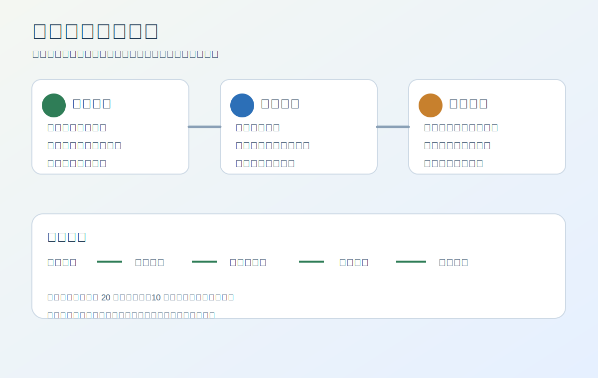

# 报告说明与阅读导览

报告目的：本报告评审的是“社区工具共享平台”是否值得进入最小可行产品实验。它关注的不是平台愿景是否有想象力，而是一个明确社区内是否存在足够工具供给、借用需求、信任基础和可控纠纷成本。

适用阶段：这份报告适用于小范围实验前的预评审。能做什么与不能替代什么：WheelWise 能帮助确定实验边界、证据缺口和停止条件，但不替代真实社区调研、物业或社区组织确认、押金与责任规则审查、法律意见、投资判断或组织决策。核心结论预览：当前可以进入有限最小可行产品实验，但不能做跨社区平台。阅读方式：先阅读预评审结论、核心判断逻辑和分阶段验证计划，再看线下风险、技术范围和最终行动。

交付文件夹为 `examples/community-tool-share/`，源报告为 `report.md`，网页展示为 `index.html`，交互原型为 `prototype.html`，资源目录为 `assets/`，内部状态和证据分别记录在 `project-state.md` 与 `evidence-board.md`。

## 项目标题

本次预评审对象是社区工具共享平台，一个让小区居民发布、预约、借用和归还低频工具的本地共享 idea。它的核心判断不在网页功能，而在线下履约是否能在小范围内跑通。

## 预评审结论

本 idea 的预评审状态是 **可进入最小可行产品实验**。下一阶段建议是在一个社区内做有限闭环实验。为什么是当前状态：目标用户、使用场景、替代行为和核心流程相对清晰，且主要风险可以通过单社区、小样本、有限品类和人工运营控制。与前两个示例不同，这个 idea 的关键不只是“用户是否理解原型”，而是供给、预约、交接、损坏和纠纷能否形成最小闭环。

为什么不是更激进状态：现在不能做跨社区平台或规模化产品，因为真实供需密度、押金规则、责任边界和运营成本仍未验证。为什么不是更保守状态：线下实验可以在一个社区、少量工具和人工审核条件下进行，信息收益高且风险可控，因此不必停留在原型验证或纯补证。

升级条件是，30 天内一个社区能形成稳定工具供给、完成至少 20 次预约或借用尝试，且损坏、取消和纠纷率在可管理范围内。降级或停止信号是，居民不愿发布工具、借用频率太低、交接成本过高、押金或责任争议频繁。关键支持证据是场景具体、流程可实验；关键反驳证据是线下履约复杂；最高影响证据缺口是真实供需密度和纠纷率；关键假设是社区成员愿意在规则明确时发布和借用工具。

## 核心判断逻辑

这个 idea 为什么值得进入最小可行产品实验，是因为它的价值必须通过真实社区密度验证。低频工具购买浪费、临时借用不便和邻里群信息混乱都是真实可想象的场景，但这些并不能自动证明平台成立；只有当同一社区内同时出现可借工具、借用需求和可接受的交接规则时，产品才有继续价值。

当前判断既有支持也有边界。线下工具存在损坏和责任风险是事实，社区信任可以降低冷启动是合理假设，真实借用频率和纠纷成本是关键证据缺口。与纯数字产品不同，这里的最大不确定性不是界面可用性，而是线下履约成本是否吞掉平台带来的便利。

下一步验证最合适的动作是小范围最小可行产品实验，而不是只做原型，也不是直接扩大平台。实验要把工具发布、预约、押金或责任确认、交接、归还和异常记录作为一个闭环来测，才能判断这个 idea 是社区服务机会，还是只适合作为邻居群的辅助公告板。

## 执行摘要

本报告建议在一个明确社区内进入有限范围的最小可行产品实验。实验范围应控制在少量低风险工具、人工审核、明确交接规则和异常记录，不做跨社区扩张、不做复杂信用系统、不做自动押金或支付闭环。

最关键证据是场景具体、流程可实验；最关键证据缺口是真实供需密度、借用频率、交接成本和纠纷率。若实验数据支持继续，才有必要讨论更完整的产品和商业化。

## 原始想法与关键假设

原始想法是做社区工具共享平台，让居民发布闲置工具，其他居民预约借用。它隐含的假设包括：社区内有足够闲置工具，居民愿意借给邻居，借用者愿意遵守规则，押金或责任机制可以被接受。

这些假设中，线下风险和工具损坏是较稳定事实，社区信任和供需密度仍是假设。当前数据足以支持小范围实验，不足以支持规模化平台判断。

## 调研方法与证据等级

本示例未执行实时社区调研，因此数据仅作为预评审样板。证据来自场景推断、线下风险分析和替代方案比较；真实社区供给、需求频率、物业态度和押金规则需要实验补足。

| 证据项 | 数据来源 | 证据类型 | 证据分类 | 影响的结论 | 证据强度 | 信心等级 | 缺口 |
| --- | --- | --- | --- | --- | --- | --- | --- |
| 低频工具存在共享场景 | 场景分析 | 用户需求 | 推断 | 支持小范围实验 | 中 | 中 | 真实频率 |
| 线下物品存在损坏风险 | 风险分析 | 风险 | 事实 | 限制实验范围 | 高 | 高 | 纠纷率 |
| 社区信任降低冷启动 | 产品推断 | 用户行为 | 假设 | 支持单社区试点 | 中 | 中 | 供给密度 |
| 押金和责任规则未知 | 未验证 | 证据缺口 | 证据缺口 | 阻止规模化 | 高 | 低 | 规则测试 |

证据说明它可以进入实验，但实验必须以线下履约数据为核心。

## 评审委员会意见

评审委员会的共识是：这个 idea 比较适合最小可行产品实验，因为价值依赖真实供需和履约闭环；同时，风险视角要求严格限制范围，避免过早平台化。

| 评审视角 | 核心判断 | 证据分类 | 支持证据 | 反驳证据 / 缺口 | 下一步验证 |
| --- | --- | --- | --- | --- | --- |
| 产品 | 可做单社区闭环 | 推断 | 流程具体 | 履约复杂 | 30 天试点 |
| 市场 | 本地密度决定成败 | 假设 | 低频工具场景 | 供需未知 | 工具盘点 |
| 用户 | 居民和组织者明确 | 推断 | 社区边界清楚 | 信任需规则 | 居民访谈 |
| 技术 | 最小闭环可实现 | 事实 | 列表和预约简单 | 支付暂缓 | 状态流转原型 |
| 复用 | 预约模块可复用 | 推断 | 通用能力多 | 线下规则自研 | 模块决策 |
| 商业化 | 先不收费 | 假设 | 押金复杂 | 服务费未知 | 试点后评估 |
| 风险 | 损坏和责任最高 | 事实 | 线下物品风险 | 规则未知 | 异常记录 |
| 执行 | 小范围可控 | 推断 | 一个社区可操作 | 需要入口 | 找试点社区 |
| 视觉 / 原型 | 预约和归还可模拟 | 事实 | 状态清晰 | 线下交接需实测 | 试点看板 |

## 目标用户与使用场景

主要用户是同一小区居民，早期用户包括有闲置工具的居民、临时需要工具的人、物业或社区组织者。购买者或推动者可能不是单个居民，而是能组织试点的社区负责人或志愿者。

用户当前替代行为是邻居群询问、直接购买、找租赁门店或借朋友工具。这个替代行为说明产品必须比群聊更可检索、比购买更省钱、比租赁更近，同时不能让交接和赔偿规则变得更麻烦。

## 问题痛点与需求强度

需求强度为中，且高度依赖社区密度。低频工具购买确实浪费，但借用频率可能不高；如果一个社区内工具供给和需求都不足，平台感会迅速消失。这个判断决定了验证计划必须优先看真实供需，而不是只看居民是否觉得页面好用。

采用阻力主要来自损坏赔偿、押金、交接时间和邻里信任。这个阻力不是界面能完全解决的，必须通过试点规则、人工运营和异常记录验证。

## 市场吸引力与机会窗口

市场机会不是全国性共享平台，而是社区服务中的本地密度机会。成熟度较低，竞争来自邻居群、租赁门店和自行购买；进入难度集中在线下运营，而非技术。

机会窗口在熟人或半熟人社区中先验证规则。如果单社区能跑通，再考虑物业合作或多社区复制；如果单社区都无法形成足够借用频率，规模化讨论应停止。

## 竞品与替代方案分析

最强替代方案是邻居群，因为它已经存在信任关系和沟通渠道，只是难检索、难记录、难沉淀规则。本 idea 必须证明结构化预约和责任规则比群聊更省事。

| 竞品 / 替代方案 | 目标用户 | 核心能力 | 价格 / 成本 | 优势 | 弱点 | 对本想法的启示 | 证据来源 |
| --- | --- | --- | --- | --- | --- | --- | --- |
| 邻居群 | 小区居民 | 直接询问 | 低 | 信任较高 | 难检索和追踪 | 产品要更有序 | 场景分析 |
| 租赁门店 | 本地用户 | 专业租赁 | 中 | 规则清楚 | 距离和价格 | 可参考押金规则 | 替代分析 |
| 自行购买 | 个人 | 拥有工具 | 高 | 随时可用 | 闲置浪费 | 强化节省成本 | 场景分析 |

如果群聊已经足以满足大多数借用，本 idea 应降级为公告板或目录工具。

## 原始方向校准

原始方向“做社区工具共享平台”需要收窄为“一个社区内的最小闭环实验”。支持原方向的是场景具体、流程可验证；反驳原方向的是履约和纠纷成本未知。

推荐方向没有改变核心问题，但限制了规模和功能。偏移程度为轻微到中等，不需要用户额外确认，但必须在报告和原型中明确“单社区、少量工具、人工审核”的边界。

## 产品定位与差异化

产品定位应是“社区低频工具的可信预约与归还记录”，而不是泛共享平台。差异化来自工具目录、预约状态、交接规则、异常记录和社区边界，而不是单纯发布列表。

可被用户感知的差异是：比群聊更容易找到工具、知道谁在借、何时归还、出问题如何处理。可防守性来自社区关系和规则沉淀，而不是技术壁垒。

## 最小可行产品范围

当前可以进入最小可行产品实验，但范围必须非常小。范围内包括工具发布、预约申请、人工确认、交接记录、归还状态、损坏或取消记录、基础规则说明和试点数据看板。

范围外包括跨社区扩张、自动押金、信用评分、保险、支付抽佣、复杂物流和开放平台。成功标准是 30 天内形成有效供需和可控异常；停止条件是供需稀疏、纠纷频繁或交接成本过高。

## 商业模式与获客假设

商业化应暂缓。当前阶段应验证社区运营价值，不应急于收服务费或做押金抽佣。可能路径包括物业合作、社区运营工具、低额服务费或工具维护费，但这些都要等实验数据证明借用频率和管理成本。

获客应从一个有明确组织入口的社区开始，例如物业、业委会、社区志愿者或熟人群。没有社区入口时，冷启动成本会明显上升。

## 合规与上线前置项

本节不构成法律意见。该 idea 涉及押金、物品损坏、个人信息、线下安全和责任边界。正式上线或收费前需要确认经营主体、备案要求、用户协议、隐私政策、押金规则、赔偿责任、发票税务和平台责任范围；上线前必须确认高风险工具排除规则。

实验阶段应避免自动押金和复杂收费，采用人工规则确认、低风险工具和异常记录。涉及高价值、危险或需要资质的工具应排除在首轮范围外。

## 关键风险与不确定性

最大风险是线下履约成本过高。工具损坏、归还延迟、交接时间不匹配和责任争议都会让平台便利性下降。第二风险是供需密度不足，导致产品只剩一个空目录。

| 风险 | 类别 | 严重程度 | 可能性 | 数据来源 | 影响 | 缓解方式 |
| --- | --- | --- | --- | --- | --- | --- |
| 工具损坏争议 | 线下履约 | 高 | 中 | 事实 + 推断 | 阻碍发布 | 限定品类和规则 |
| 供需密度不足 | 市场 / 用户 | 高 | 中 | 证据缺口 | 无法形成闭环 | 单社区盘点 |
| 交接成本过高 | 执行 | 中 | 中 | 推断 | 降低使用频率 | 预约窗口和记录 |

## 决策记录与选项排除

本次评审选择最小可行产品实验，排除了只做静态原型和直接做规模化平台。静态原型无法验证线下履约，规模化平台又会在供需和规则未明时放大风险。

| 决策 | 当前建议 | 考虑过的选项 | 被排除的选项 | 排除原因 | 依赖的关键假设 | 假设失效后的动作 | 下一步验证 |
| --- | --- | --- | --- | --- | --- | --- | --- |
| 预评审状态 | 可进入最小可行产品实验 | 原型 / 补证 / 放弃 | 跨社区平台 | 规模化证据不足 | 单社区能跑通 | 降级为公告板 | 30 天试点 |
| 交付形态 | 网页应用式流程 | 网页 / 小程序 / 群工具 | 复杂平台 | 过早 | 居民能操作 | 群公告辅助 | 预约测试 |
| 商业化路径 | 暂缓收费 | 服务费 / 押金 / 免费 | 立即收费 | 规则未定 | 先验证频率 | 停止商业化 | 试点数据 |

## 横向比较评分

以下评分用于多个 idea 的相对预评审比较，不是投资排序、审批结论或成功率承诺。社区工具共享的用户问题强度中等，技术可行性较高，但风险可控性和执行复杂度取决于线下试点。

| 评分维度 | 评分 | 证据分类 | 评分依据 | 证据缺口 | 下一步验证 |
| --- | --- | --- | --- | --- | --- |
| 用户问题强度 | 6 | 推断 | 低频工具场景具体 | 真实频率未知 | 社区盘点 |
| 目标用户清晰度 | 8 | 推断 | 单社区居民明确 | 组织入口未知 | 找试点 |
| 证据充分度 | 5 | 证据缺口 | 场景清楚但缺数据 | 供需密度 | 30 天实验 |
| 市场机会 | 6 | 假设 | 本地密度机会 | 可复制性未知 | 单社区验证 |
| 差异化 | 6 | 推断 | 比群聊更有序 | 用户是否需要未知 | 群聊对比 |
| 交付形态匹配 | 7 | 事实 | 列表预约适合网页 | 小程序可能更便捷 | 原型测试 |
| 技术可行性 | 8 | 事实 | 最小闭环简单 | 支付暂缓 | 状态流转 |
| 商业化可行性 | 4 | 证据缺口 | 先不收费 | 服务费未知 | 试点后访谈 |
| 风险可控性 | 5 | 推断 | 小范围可控 | 纠纷率未知 | 异常记录 |
| 执行复杂度 | 5 | 推断 | 需社区运营 | 入口未知 | 物业沟通 |

总体预评审等级：中，可进入有限最小可行产品实验。

## 分阶段验证计划

当前最大的证据缺口是单社区内的供需密度和履约成本。现在验证它比继续打磨界面更重要，因为工具共享是否成立取决于真实预约、交接和归还，而不是页面是否像平台。

| 验证动作 | 验证目标 | 为什么现在验证 | 方法 | 需要收集的数据 | 成功标准 | 失败信号 | 失败后的处理 / 失败后调整 | 当前阶段不应该做 |
| --- | --- | --- | --- | --- | --- | --- | --- | --- |
| 工具供给盘点 | 验证供给密度 | 无供给就无平台 | 招募一个社区居民登记工具 | 工具数、品类、可借意愿 | 20 件以上低风险工具 | 发布意愿低 | 转为公告板 | 不跨社区扩张 |
| 预约闭环实验 | 验证真实需求 | 决定是否继续 | 30 天记录预约与归还 | 预约数、完成率、取消率 | 20 次预约尝试且多数完成 | 借用频率低 | 降级或暂停 | 不做支付抽佣 |
| 异常与规则测试 | 验证风险可控 | 线下风险会改变结论 | 记录损坏、延迟和争议 | 异常率、处理时长、争议原因 | 异常可人工处理 | 纠纷频繁 | 缩小品类或停止 | 不开放高风险工具 |

## 技术与复用方案

因为状态是可进入最小可行产品实验，技术方案可以覆盖最小闭环、数据模型、状态流转和实验指标，但仍不做规模化架构。最小闭环包括工具、用户、预约、交接、归还和异常记录。

| 模块 | 决策 | 推荐方案 | 为什么选择它 | 为什么不选替代方案 | 证据 | 假设 | 风险 | 兜底方案 | 信心等级 |
| --- | --- | --- | --- | --- | --- | --- | --- | --- | --- |
| 工具目录 | 自研 | 简单列表和筛选 | 支持供给盘点 | 不买复杂平台 | 实验需要 | 居民愿登记 | 空目录 | 人工表单 | 中 |
| 预约状态 | 自研 | 申请、确认、归还、异常 | 构成最小闭环 | 不做复杂信用 | 流程事实 | 状态足够 | 交接偏差 | 人工备注 | 中 |
| 押金规则 | 参考 | 暂不自动收取 | 降低合规复杂度 | 不接支付 | 风险事实 | 人工规则可行 | 争议 | 线下确认 | 低 |

## 前端展示与交互原型

`index.html` 是报告可视化展示层，展示预评审状态、供需密度假设、风险矩阵、评分和试点路径。源报告关系是：它只解释同一份 `report.md`，不新增事实来源。`prototype.html` 是独立的社区工具预约模拟器，展示工具列表、预约申请、归还状态、异常记录和未接入真实后端边界。

核心交互包括工具筛选、预约申请、归还确认和异常记录。原型必须包含模拟数据、可点击预约、状态变化、加载 / 空状态 / 错误 / 成功状态和响应式布局。视觉资产用于解释最小闭环和线下风险。

## 可交给 Codex 执行的计划

当前计划是有限最小可行产品实验任务。Codex 应更新报告、状态、证据中枢、可视化网页、预约模拟器和视觉资产，并确保实验指标和停止条件进入页面。

不要实现跨社区扩张、自动押金、信用评分、保险、复杂支付或开放平台能力。

## 最终建议与下一步行动

一句话判断：最终建议是在一个社区内做有限最小可行产品实验。预评审状态：可进入最小可行产品实验。7 天内完成试点社区确认和工具供给盘点，14 天内上线最小预约流程并开始记录交接，30 天内根据预约完成率、异常率和居民反馈决定是否继续。这个时间窗口服务于供需密度和履约成本证据缺口。

继续条件是一个社区内形成足够工具供给、出现真实预约且异常可人工处理；停止条件是借用频率太低、居民不愿发布工具、纠纷处理成本高于便利收益。上线前必须确认个人信息、押金责任、用户协议、隐私政策和高风险工具排除规则。
