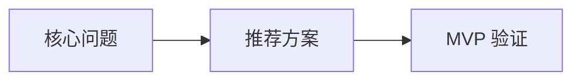

# 报告说明与阅读导览

报告文件：`wheelwise-report.md`

报告目的：
用较短篇幅说明产品想法的核心判断、交付形态、复用决策、视觉 / Demo 方向和下一步执行计划。

适用阶段：
适用于用户要求快速评估、轻量验证或需要一份可继续扩写的中文报告初稿。

核心结论预览：
本报告先给结论，再按用户问题、方案判断、视觉与 Demo、风险验证、执行计划和行动建议递进展开。

阅读方式：
先看结论和交付形态，再看 Build / Buy / Reuse / Fork / Reference 决策，最后看 Codex-ready 执行计划与 go/no-go 条件。

## 项目标题

项目名称：

报告文件：

## 想法摘要

## 交付形态

## 结论：构建 MVP / 先验证 / 暂停 / 放弃

## 决策解释摘要

| 决策领域 | 决策是什么 | 为什么选择它 | 为什么不选替代方案 | 信心等级 |
| --- | --- | --- | --- | --- |

## 目标用户

## 问题与紧迫性

## 市场备注

## 用户假设

## 差异化

## MVP 范围

## 产品策略

## Build / Buy / Reuse / Fork / Reference 决策

| 模块 | 决策 | 为什么选择它 | 为什么不选替代方案 | fallback |
| --- | --- | --- | --- | --- |

## 技术实现路径

## 视觉说明

图片资产或 prompt：

```markdown

```

Mermaid fallback：



## UI Demo / 交互 Demo

Demo 路径：

运行方式：

核心交互：

mock 数据说明：

loading / empty / error / success 状态：

未接入真实后端的范围：

## HTML 展示文件

默认文件：
`wheelwise-report.html`

用途：
HTML 是展示层，内容来自 Markdown 报告，用于展示封面、核心结论、决策地图、MVP 路线图、视觉说明、Demo 截面、风险与验证、执行计划。

生成状态：
已生成 / 建议生成 / 本轮跳过。

## 商业化备注

## 关键风险

## 验证实验

## Codex-ready 执行计划

Markdown 报告任务：

```text
生成或更新 wheelwise-report.md，确保报告正文全中文、结构递进，并包含视觉说明、Demo 说明、HTML 展示文件记录和最终行动建议。
```

HTML 展示文件任务：

```text
如启用展示层，生成或更新 wheelwise-report.html，并确保内容来源于同一份中文 Markdown 报告。
```

## 最终建议与下一步行动

一句话判断：

7 天行动：

14 天行动：

30 天行动：

go/no-go 条件：

继续/停止条件：
