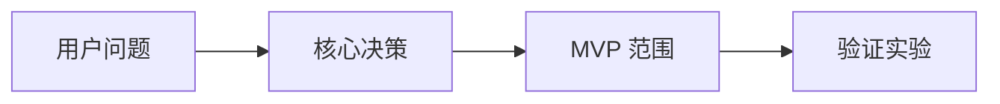

# 报告说明与阅读导览

报告文件：`wheelwise-report.md`

报告目的：
说明这个产品想法是否值得推进、应该以什么交付形态验证、哪些模块应 Build / Buy / Reuse / Fork / Reference，以及下一步如何交给 Codex 执行。

适用阶段：
适用于从原始 idea 到 MVP 立项前的判断阶段，也适用于已有想法需要重新收敛交付形态、差异化、复用方案和技术路径的阶段。

核心结论预览：
本报告会先给出结论，再解释目标用户、问题紧迫性、市场与竞品、MVP 范围、技术实现、视觉与 Demo、风险验证和执行计划。

阅读方式：
先读 `结论：构建 MVP / 先验证 / 暂停 / 放弃` 和 `交付形态`，确认大方向；再读 `Build / Buy / Reuse / Fork / Reference 决策` 和 `技术实现路径`，确认工程路线；最后读 `Codex-ready 执行计划` 和 `最终建议与下一步行动`，决定是否进入执行。

## 项目标题

项目名称：

报告文件：

## 想法摘要

一句话描述：

用户要完成的事情：

产品承诺：

当前判断：

## 交付形态

主要交付形态：

备选形态：

形态约束：

决策解释：

- 决策是什么：
- 为什么选择它：
- 为什么不选替代方案：
- 证据：
- 假设：
- 风险：
- fallback：
- 信心等级：

## 结论：构建 MVP / 先验证 / 暂停 / 放弃

结论：

信心等级：

适用前提：

决策解释：

- 决策是什么：
- 为什么选择它：
- 为什么不选替代方案：
- 证据：
- 假设：
- 风险：
- fallback：
- 信心等级：

## 决策解释摘要

| 决策领域 | 决策是什么 | 为什么选择它 | 为什么不选替代方案 | 证据 | 假设 | 风险 | fallback | 信心等级 |
| --- | --- | --- | --- | --- | --- | --- | --- | --- |

## 目标用户

主要用户：

早期用户：

购买者 / 决策者：

使用场景：

## 问题与紧迫性

核心问题：

为什么现在需要解决：

用户当前替代方案：

痛点强度：

## 市场备注

市场类别：

竞品 / 替代品：

市场信号：

需要继续调研的问题：

## 用户假设

| 假设 | 为什么重要 | 当前证据 | 需要验证 |
| --- | --- | --- | --- |

## 差异化

差异化主张：

不是差异化的部分：

可被用户感知的差异：

可防守性：

## MVP 范围

范围内：

范围外：

MVP 成功标准：

首轮验证对象：

## 产品策略

定位：

用户可见流程：

功能优先级：

产品切入点：

优先验证内容：

产品假设：

决策解释：

- 决策是什么：
- 为什么选择它：
- 为什么不选替代方案：
- 证据：
- 假设：
- 风险：
- fallback：
- 信心等级：

## Build / Buy / Reuse / Fork / Reference 决策

| 模块 | 决策 | 推荐方案 | 为什么选择它 | 为什么不选替代方案 | 证据 | 假设 | 风险 | fallback | 信心等级 |
| --- | --- | --- | --- | --- | --- | --- | --- | --- | --- |

## 技术实现路径

推荐技术栈：

高层架构：

数据模型草图：

集成方案：

部署路径：

交付形态约束：

与复用决策的一致性：

决策解释：

- 决策是什么：
- 为什么选择它：
- 为什么不选替代方案：
- 证据：
- 假设：
- 风险：
- fallback：
- 信心等级：

## 视觉说明

> 优先生成真实图片资产并用 Markdown 引用；没有生图能力时，使用 Mermaid 作为 fallback。至少包含决策地图、MVP 路线图或验证漏斗之一。

| 视觉标题 | 类型 | 解释内容 | 为什么帮助理解推荐方案 | 图片生成 prompt / 制作方法 | 放置位置 |
| --- | --- | --- | --- | --- | --- |

图片资产：

```markdown

```

Mermaid fallback：



## UI Demo / 交互 Demo

Demo 路径：

运行方式：

核心交互：

页面 / 屏幕 / 模拟器面板：

mock 数据说明：

loading / empty / error / success 状态：

未接入真实后端的范围：

## HTML 展示文件

默认文件：
`wheelwise-report.html`

生成状态：
已生成 / 建议生成 / 本轮跳过。

用途：
HTML 是展示层，用来呈现封面、核心结论、决策地图、MVP 路线图、视觉说明、Demo 截面、风险与验证、执行计划；Markdown 报告仍是事实来源。

生成方式：
可参考 UI UX Pro Max 或其他 UI/UX skill 的设计智能，但不能复制外部 skill 内容；如果没有 UI/UX skill，则由 `ui-demo` 给出 HTML 展示规格和 Codex-ready 实现任务。

## 商业化备注

商业模式：

定价或包装假设：

获客渠道：

早期变现测试：

决策解释：

- 决策是什么：
- 为什么选择它：
- 为什么不选替代方案：
- 证据：
- 假设：
- 风险：
- fallback：
- 信心等级：

## 关键风险

| 风险 | 类别 | 严重程度 | 可能性 | 缓解方式 |
| --- | --- | --- | --- | --- |

## 验证实验

| 实验 | 验证内容 | 方法 | 成功标准 | 失败后的处理 |
| --- | --- | --- | --- | --- |

## Codex-ready 执行计划

### 里程碑 1

目标：

任务：

文件 / 模块：

测试：

验收标准：

Codex-ready prompt：

视觉说明任务：

UI Demo / 交互 Demo 任务：

HTML 展示文件任务：

Markdown 报告任务：

```text
生成或更新 wheelwise-report.md，确保报告正文全中文、结构递进，并包含视觉说明、Demo 说明、HTML 展示文件记录、决策解释、风险、验证实验和 Codex-ready 执行计划。
```

## 最终建议与下一步行动

一句话判断：

7 天行动：

14 天行动：

30 天行动：

go/no-go 条件：

继续/停止条件：
