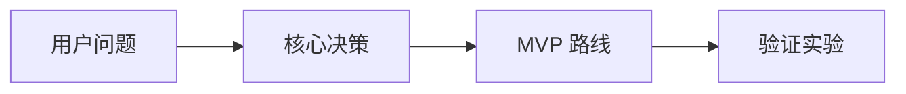

# 视觉说明

## 视觉摘要

视觉目标：

报告放置位置：

网页展示位置：

## 视觉资产

| 视觉标题 | 类型 | 解释内容 | 为什么帮助理解推荐方案 | 源报告放置位置 | 网页展示位置 |
| --- | --- | --- | --- | --- | --- |

## 图片生成说明 / 制作方法

### 视觉 1

视觉标题：

类型：

图片生成说明 / 制作方法：

图片文字要求：
图片内文字必须为中文；如果不能稳定生成正确中文，则生成无文字图片。

Markdown 图片引用：

```markdown

```

兜底方案：



## 生成策略

优先级：
有生图能力时生成真实图片资产；没有生图能力时，使用 Mermaid 制作决策地图、MVP 路线图或验证漏斗。

网页用途：
如果生成 `index.html`，本视觉说明应同时服务于网页的决策地图、路线图、视觉说明或演示截面。

## 决策解释

决策是什么：

为什么选择它：

为什么不选替代方案：

证据：

假设：

风险：

兜底方案：

信心等级：
